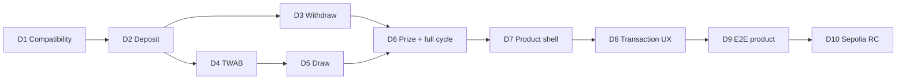

# PayDay Pot — 10-Day Build Plan

> **Sprint:** 17/08/2026 → 26/08/2026  
> **Team assumption:** 1 lead developer dùng Codex hỗ trợ, 8–10 giờ tập trung/ngày  
> **Target cuối Day 10:** release candidate chạy full cycle trên Sepolia  
> **Internal submission freeze:** 04/09/2026 18:00 ICT  
> **Buffer sau sprint:** 27/08 → 04/09 cho hardening, video và submission

Kế hoạch 10 ngày được ưu tiên hơn kế hoạch phase dài trong tài liệu tổng. Mục tiêu không phải hoàn thành nhiều feature nhất mà là có một vertical slice đúng, private, test được và demo được.

---

## 1. Kết quả bắt buộc sau 10 ngày

Đến cuối Day 10, một judge dùng fresh wallet phải thực hiện được:

```text
Get test USDC
→ shield thành cUSDC
→ deposit confidentially
→ EIP-712 reveal own balance/TWAB
→ employer funds public prize
→ trigger encrypted TWAB draw
→ reveal own result
→ claim encrypted prize
→ withdrawAll principal
```

Đi kèm:

- Verified `PayDayPot` contract trên Sepolia.
- Public responsive website có đủ 5 màn hình.
- Local contract tests, browser E2E và live smoke đều xanh.
- Privacy boundary/known limitations đúng với behavior thật.
- Runbook có tx hashes để rehearsal video.

---

## 2. Quy tắc thực thi

### Hard rules

1. Không qua ngày mới nếu exit gate P0 của ngày hiện tại chưa đạt.
2. Không polish animation khi contract vertical slice chưa hoàn tất.
3. Không thêm multi-employer, real yield, auto-payroll, multiple prizes hoặc localization trong sprint.
4. Mỗi ngày kết thúc bằng một demo chạy được, test và cập nhật tài liệu.
5. Nếu một API FHE/ERC-7984 chưa chắc chắn, spike/compile/test trước khi xây abstraction.
6. Mọi clear monetary value bị cấm khỏi logs, analytics, URL và persistence từ Day 1.
7. `withdrawAll`, encrypted draw và EIP-712 reveal không được chuyển sang buffer.

### Daily Definition of Done

- Code compile/typecheck.
- Test mới của ngày chạy xanh.
- Không có known blocker bị giấu trong UI mock.
- README/runbook ghi lại command, decision và tx hash mới.
- Commit/tag nội bộ có thể quay lại.
- EOD demo dưới 5 phút từ một trạng thái sạch.

### Nhịp làm việc đề xuất

| Block | Nội dung |
|---|---|
| 09:00–09:20 | Reproduce trạng thái hôm trước, chốt goal và blocker |
| 09:20–12:00 | Core implementation; không họp/không polish |
| 13:00–15:30 | Integration và negative/error cases |
| 15:30–17:30 | Tests, fix, responsive/UX nếu thuộc scope ngày |
| 17:30–18:30 | EOD demo, docs, commit và plan ngày sau |

---

## 3. Tổng quan 10 ngày

| Day | Date | Outcome chính | Mốc |
|---:|---|---|---|
| 1 | 17/08 | Toolchain + FHE/ERC-7984 compatibility proven | Foundation |
| 2 | 18/08 | Encrypted deposit và principal ledger đúng | Money in |
| 3 | 19/08 | Partial/full withdrawal + no-loss invariants | Money out |
| 4 | 20/08 | TWAB checkpoint/snapshot đúng thời gian | Fair weight |
| 5 | 21/08 | FHE random + multiply-high + batch winner selection | Fair draw |
| 6 | 22/08 | Sponsor prize + result + claim; local full cycle | Protocol complete |
| 7 | 23/08 | App shell, Landing, Onboarding, Dashboard | Product entry |
| 8 | 24/08 | My Savings + Employer funding flows | Money UX complete |
| 9 | 25/08 | Dark Draw Room + full browser E2E | Product complete |
| 10 | 26/08 | Sepolia RC deploy, smoke, QA và runbook | Release candidate |

Critical path:



---

## Day 1 — Foundation and compatibility proof

**Date:** 17/08  
**Outcome:** không còn bất kỳ phỏng đoán nào về package versions, SDK/WASM, official wrapper hoặc ERC-7984/FHE API cơ bản.

### Morning — repository and versions

- Initialize pnpm workspace/Turborepo:
  - `apps/web`
  - `packages/contracts`
  - `packages/sdk`
  - `packages/shared`
  - `packages/test-utils`
- Enable TypeScript strict, lint, format và minimal CI.
- Start từ official FHEVM Hardhat template thay vì copy Season 3 code.
- Pin exact versions của:
  - `@fhevm/solidity`
  - Hardhat FHE plugin
  - OpenZeppelin Confidential Contracts
  - Zama JS/React SDK
  - wagmi/viem.
- Create `deployments/sepolia.json` schema và chain/address single source of truth.

### Afternoon — live compatibility spike

- Resolve official wrapper registry và validate cUSDC pair.
- Compile minimal contract có:
  - encrypted input verification;
  - `FHE.add`;
  - `FHE.allowThis`/`FHE.allow`;
  - user-owned ciphertext getter.
- Build minimal client-only page:
  - initialize FHE SDK/WASM;
  - connect wallet/Sepolia;
  - encrypt one input;
  - call contract;
  - EIP-712 user-decrypt output.
- Verify production headers/COOP/COEP không phá wallet flow.
- Inspect current ERC-7984 actual-transfer/callback API; record chosen integration path.

### Deliverables

- Green monorepo install/build/test.
- `COMPATIBILITY_NOTES.md` hoặc architecture decision entry.
- One real Sepolia encrypted-input + user-decrypt tx.
- Locked dependency versions.
- Exact cUSDC/underlying/registry validation script.

### Exit gate — không được bỏ qua

- [ ] Clean clone installs with frozen lockfile.
- [ ] Minimal contract compiles and deploys locally/Sepolia.
- [ ] Browser encrypts and EIP-712 decrypts a value successfully.
- [ ] Official wrapper pair validated at runtime.
- [ ] Exact actual-transfer integration path chosen; no dual path.
- [ ] SDK works in Next.js production build, not only dev mode.

### If behind

- Drop Turborepo caching/UI library setup.
- Keep simple pnpm workspace.
- Do **not** move API uncertainty to Day 2.

### EOD demo

Connect wallet → write encrypted value → sign user-decrypt → reveal own value.

---

## Day 2 — Confidential deposit and principal accounting

**Date:** 18/08  
**Outcome:** cUSDC enters the vault confidentially and principal accounting credits the actual encrypted transfer.

### Contract work

- Create non-upgradeable `PayDayPot.sol` skeleton.
- Configure immutable accepted ERC-7984 token, employer, epoch duration and caps.
- Initialize encrypted zeros safely; do not use uninitialized handles as numeric zero.
- Implement employee registration/open-demo enrollment.
- Implement one deposit path only:
  - encrypted transfer-and-call callback; or
  - approved encrypted pull selected on Day 1.
- Validate token caller, sender/input proof and action tag.
- Credit `actualTransferred`, never requested amount.
- Update encrypted user principal and encrypted aggregate.
- Reapply contract/user ACL on new handles.
- Events contain action/user/epoch only, no amount.

### SDK/test work

- Add typed `deposit()` action and handle queries.
- Unit/integration cases:
  - normal deposit;
  - requested > available;
  - zero deposit/zero transfer;
  - invalid proof;
  - wrong token/callback;
  - duplicate submission protection at client reducer.
- Verify Alice can decrypt updated principal; Bob cannot.

### Deliverables

- `SC-01` implemented.
- Deposit ABI/types generated into shared manifest.
- Contract tests for actual-transfer semantics.
- Minimal deposit script and receipt output.

### Exit gate

- [ ] Alice deposits encrypted cUSDC and decrypts exact credited principal.
- [ ] Requested > available cannot inflate principal.
- [ ] Bob/employer cannot decrypt Alice principal.
- [ ] No plaintext amount in event/log/backend.
- [ ] New handle has correct ACL.
- [ ] Deposit test is deterministic in local FHE mode.

### If behind

- Keep open enrollment; defer employer invite/Merkle root.
- Do not add activity indexer.
- Do not weaken actual-transfer accounting.

### EOD demo

Alice confidential deposit → contract receipt → Alice reveal → Bob decrypt denied.

---

## Day 3 — Withdrawal and no-loss safety

**Date:** 19/08  
**Outcome:** user retrieves partial or full principal in every protocol state without touching prize funds.

### Contract work

- Implement `withdraw(externalEuint64, proof)`.
- Implement `withdrawAll()` using stored encrypted principal.
- Calculate/transfer safe actual amount and subtract actual transfer.
- Update aggregate and ACL.
- Add `ReentrancyGuard`, checks-effects-interactions and safe token-call validation.
- Implement pause scope:
  - deposit/new draw can pause;
  - withdraw/claim never pause.
- Define prize/principal logical ledger boundaries before sponsor funding exists.

### Test work

- Partial withdrawal.
- Full withdrawal without prior balance reveal.
- Request > principal privacy-safe behavior.
- Repeated `withdrawAll()`.
- Withdrawal while paused.
- Withdrawal before cutoff, after cutoff and placeholder draw phases.
- Reentrancy/malicious token callback.
- Principal conservation property sequences: deposit/withdraw/deposit/withdrawAll.

### Deliverables

- `SC-02` and first no-loss invariant suite.
- Public function matrix documenting pause behavior.
- Typed SDK withdraw actions.

### Exit gate

- [ ] `withdrawAll()` returns exact principal and then becomes idempotent.
- [ ] Pause cannot trap funds.
- [ ] Requested > balance cannot burn internal claim or leak balance through clear error.
- [ ] Asset/principal accounting remains conserved across randomized sequences.
- [ ] Contract has no admin principal sweep.

### If behind

- Ship `withdrawAll()` before polished partial-withdraw UI.
- Defer employer disable/allowlist logic.
- Do not defer no-loss invariants.

### EOD demo

Deposit → pause contract → withdrawAll → decrypt/verify zero remaining principal.

---

## Day 4 — Encrypted TWAB checkpoints

**Date:** 20/08  
**Outcome:** weight reflects encrypted balance × time, resists late deposits and freezes exactly at epoch cutoff.

### Contract work

- Implement account fields:
  - `euint64 principal`;
  - `euint128 twabArea`;
  - public `lastCheckpoint`.
- `_checkpoint(user, min(block.timestamp, epochEnd))` before every balance mutation.
- Compute `area += cast(balance) × publicElapsed`.
- Implement snapshot weight `area / plaintext epochDuration`, then safe cast.
- Freeze participant list/order/count for epoch.
- Implement snapshot cursor and batch function.
- Disable new deposit during snapshot; retain withdraw with pre-mutation checkpoint.
- Define next-epoch reset/start policy.

### Test work

- 100 full epoch → 100 weight.
- 100 half epoch → 50.
- 50 first half + 100 second half → 75.
- Last-second deposit has near-zero average weight.
- Delayed draw does not count after `epochEnd`.
- Withdraw after cutoff does not change frozen weight.
- Balance/duration/cast caps do not overflow.

### Deliverables

- `SC-03` encrypted checkpoint module.
- Written overflow budget and caps.
- HCU measurements for one checkpoint/snapshot participant.

### Exit gate

- [ ] Every reference TWAB scenario matches expectation.
- [ ] Snapshot uses `epochEnd`, never draw execution time.
- [ ] Withdraw remains functional during snapshot.
- [ ] Area uses `euint128`; divide happens before cast to `euint64`.
- [ ] Participant cap and max duration are enforced/documented.

### If behind

- Keep one epoch active at a time and a short no-deposit snapshot window.
- Do not implement concurrent overlapping epochs in P0.
- Never replace TWAB with simple end-balance snapshot silently.

### EOD demo

Alice saves full epoch, Bob joins halfway → locally decrypt test weights 2:1.

---

## Day 5 — Encrypted random and weighted selection

**Date:** 21/08  
**Outcome:** one immutable draw chooses one encrypted winner using FHE randomness and encrypted TWAB weights.

### Contract work

- Complete epoch phases: Open → Snapshotting → RandomReady → Selecting → Finalized.
- Generate `FHE.randEuint64()` exactly once after snapshot total is frozen.
- Implement multiply-high ticket:

```text
ticket = floor((R × encryptedTotalWeight) / 2^64)
```

- Promote operands to `euint128`; divide only by plaintext `2^64`.
- Implement cumulative selection batches:
  - encrypted cumulative;
  - `hit = hasWeight && !selected && ticket < cumulative`;
  - `FHE.select` award;
  - no `if(ebool)` or encrypted array index.
- Store monotonic cursor and forbid reroll/reset.
- Handle zero-participant/zero-weight reserve rollover.
- Make snapshot/select batch functions permissionless.

### Test/benchmark work

- Ticket boundaries and range for many totals.
- Exactly one winner when total > 0.
- No winner and no lost prize for total = 0.
- Reroll/reprocess/cursor regression rejection.
- Monte Carlo local distribution `1:3:6`.
- Max R × max total overflow boundary.
- HCU/latency per participant; choose initial batch 4 and cap 32 unless evidence supports more.

### Deliverables

- `SC-04` draw algorithm.
- `DRAW_PROTOCOL.md` first draft with multiply-high math.
- HCU table and chosen cap/batch constants.

### Exit gate

- [ ] No `% encryptedTotal` or encrypted divisor exists.
- [ ] Same epoch cannot generate random twice.
- [ ] Any wallet can continue draw from cursor.
- [ ] Positive total produces exactly one encrypted positive award.
- [ ] Keeper provides no seed/balance/winner input.
- [ ] Full capped draw fits bounded Sepolia transaction batches.

### If behind

- Reduce participant cap/batch size and document limitation.
- Do not switch to plaintext total, offchain RNG or admin winner.
- Skip visual Draw Room work until algorithm is green.

### EOD demo

Alice/Bob/Carol frozen weights → permissionless batch draw → local test decrypt confirms exactly one winner.

---

## Day 6 — Sponsor prize, claim and protocol vertical slice

**Date:** 22/08  
**Outcome:** local full cycle is complete; sponsor prize and employee principal are conserved independently.

### Contract work

- Implement employer-funded Sepolia prize reserve.
- Track public allocated prize and optional masked unallocated reserve.
- Reserve prize before draw; prevent allocation above backing.
- Credit encrypted `pendingPrize` during winner scan.
- Reapply ACL to each user’s new winnings handle.
- Implement `claim()`; implement `claimFor(user)` only if transfer semantics are already proven.
- Clear/decrease actual pending liability after encrypted transfer.
- Double-claim idempotence.
- Finalize/reset epoch without altering principal.

### Integration work

- Alice/Bob/Carol local scenario:
  - different TWAB weights;
  - employer funds prize;
  - draw;
  - each decrypts own winnings;
  - winner claims;
  - all withdrawAll.
- Negative ACL roles: employer/keeper/other user.
- Sepolia dev deployment and first full-cycle smoke if time permits.

### Deliverables

- `SC-05`, `SC-06` core behavior.
- Full local integration script/test.
- Draft `PRIVACY.md`, `THREAT_MODEL.md`, `KNOWN_LIMITATIONS.md` from actual behavior.
- Stable ABI for frontend.

### Exit gate — Protocol Complete milestone

- [ ] Full local flow passes from fresh state.
- [ ] Exactly one user decrypts positive prize; losers decrypt zero.
- [ ] Winner claim transfers encrypted amount once.
- [ ] Employer/keeper cannot decrypt employee principal/TWAB/winnings.
- [ ] Prize payout does not change principal liability.
- [ ] Every participant can withdraw full principal.
- [ ] ABI is frozen except blocker fixes.

### If behind

- Keep user-driven `claim()` and honest timing-leak warning; defer `claimFor`.
- Keep sponsor reserve simple/public; defer encrypted employer reserve.
- Never mix principal and prize accounting.

### EOD demo

One command/test runs employer fund → three deposits → TWAB draw → private results → claim → all withdraw.

---

## Day 7 — Product shell, Landing, Onboarding and Dashboard

**Date:** 23/08  
**Outcome:** a fresh user can understand the product, connect correctly and reach a truthful masked dashboard.

### Foundation

- Implement design tokens, typography, responsive app shell and light/dark theme boundaries.
- Build wallet/network/role guards and global transaction center.
- Implement client-only FHE provider and in-memory reveal store with TTL.
- Create public/query layer from deployment manifest.

### Screen 1 — Landing/Onboarding

- Landing hero, how it works, privacy comparison, no-loss promise, public draw preview.
- Role selection, wallet connect, Sepolia switch.
- Test asset readiness and shield privacy warning.
- Demo enrollment and review/public-private disclosure.
- Loading, wrong-network, rejected, existing-user and SDK-unavailable states.

### Screen 2 — Dashboard

- Masked principal/TWAB card.
- EIP-712 reveal/hide/session-expiry.
- Public next draw and employer boost.
- Quick Deposit/Withdraw/Draw Room actions.
- Neutral result-ready banner and masked activity list.

### Tests

- Reveal cache clears on TTL/reload/account/chain change.
- No plaintext in SSR/storage/analytics/DOM while masked.
- 320px, desktop, keyboard navigation, reduced motion shell.

### Deliverables

- `FE-01`, `FE-02` core acceptance criteria.
- Landing and Dashboard visually match mockups.
- Public page remains usable if wallet/FHE SDK fails.

### Exit gate

- [ ] Fresh incognito user completes onboarding to masked dashboard.
- [ ] Wrong network and rejected signature recover safely.
- [ ] Reveal works only after explicit EIP-712 signature.
- [ ] Refresh/account switch remasks and clears plaintext.
- [ ] No mock claims automatic payroll integration.
- [ ] Mobile and desktop primary layouts are usable.

### If behind

- Remove decorative landing sections and orb animation.
- Keep privacy boundary, onboarding, dashboard actions and reveal.
- Use direct RPC; no indexer.

### EOD demo

Incognito landing → connect/switch → enroll → masked dashboard → reveal/hide own position.

---

## Day 8 — My Savings and Employer funding UX

**Date:** 24/08  
**Outcome:** every money movement has a deterministic, recoverable UI and clear privacy disclosure.

### Screen 3 — My Savings

- Deposit, Withdraw and History tabs/routes.
- Sensitive amount input in memory only.
- Approval → Encrypt → Review → Submit → Confirm → Sync state machine.
- `Withdraw all` without prior reveal; partial withdraw path.
- Review dialog separates encrypted/private from public/linkable fields.
- Handle freshness, EIP-712 reveal, stale-handle recovery.
- Faucet/shield helper and public wrap-amount warning.
- Tx hash resume after reload.

### Screen 5 — Employer Dashboard

- Employer role guard and program overview.
- Fund prize form with approval/review/confirmation.
- Public allocated prize/schedule disclosure.
- Program health, draws and onchain audit list.
- Explicit notice: employer cannot view employee values or influence winner.
- Unauthorized/read-only, no-reserve, pending and locked-draw states.

### Tests

- Rejected approval/tx, wrong chain, insufficient gas, relayer timeout.
- Duplicate submit prevention and receipt resume.
- Employer negative-permission/API tests.
- Plaintext/draft telemetry regression.

### Deliverables

- `FE-03`, `FE-05` P0 acceptance criteria.
- Real contract writes from UI for deposit/withdraw/fund prize.

### Exit gate

- [ ] Alice deposits and withdraws through UI using real contract.
- [ ] Employer funds real prize through UI.
- [ ] Every step/error identifies exact recovery.
- [ ] Draft amount never persists or enters telemetry.
- [ ] Updated private values stay masked until a fresh reveal.
- [ ] Employer UI cannot fetch employee handles/plaintext.

### If behind

- Use one sponsor wallet and one simple funding form.
- Defer invite management, charts, exports and campaign composer.
- Keep transaction state machines and employer privacy boundary.

### EOD demo

Employee deposit/withdraw + employer fund prize from two browser profiles with rejection/retry example.

---

## Day 9 — Dark Draw Room and full browser E2E

**Date:** 25/08  
**Outcome:** the entire product journey works in browser, including private winner/loser results and claim.

### Screen 4 — Dark Draw Room

- Public draw phase timeline and permissionless Trigger/Continue controls.
- Encrypted orb as atmosphere; onchain status/cursor is source of truth.
- Masked personal TWAB/eligibility.
- Neutral sealed result before reveal.
- EIP-712 result reveal for winner and loser.
- Claim review with address/time linkage warning.
- Claim receipt and public Fairness Receipt.
- Proof failure, stale handle, already claimed, pending and offline states.

### Full E2E

- Two or three browser profiles/wallets.
- Fresh assets and onboarding.
- Different deposit timings/weights.
- Employer funding.
- Snapshot/random/select batches.
- Winner/loser local reveals.
- Winner claim and all-user withdrawAll.
- Reload at approval, deposit pending, draw cursor and claim pending.

### QA

- Mobile responsive pass for all 5 screens.
- Keyboard-only critical path.
- Reduced motion and dark-theme contrast.
- Privacy regression across DOM, storage, network mocks and telemetry.

### Deliverables

- `FE-04`, `QA-01` browser vertical slice.
- Public Fairness Receipt.
- Draft 3-minute demo sequence based on actual timings.

### Exit gate — Product Complete milestone

- [ ] Full mocked/local browser E2E is green.
- [ ] Winner/non-winner UI is identical before reveal.
- [ ] Draw resumes from cursor after reload/keeper interruption.
- [ ] Claim requires positive local reveal and finalized draw.
- [ ] Withdrawal remains reachable from Draw Room.
- [ ] All five screens pass 320px and desktop smoke.

### If behind

- Use static orb/no celebration motion.
- Show compact proof receipt instead of advanced visualization.
- Do not remove result privacy, claim disclosure or E2E tests.

### EOD demo

Run the planned 3-minute flow locally from fresh profiles without manual state edits.

---

## Day 10 — Sepolia release candidate

**Date:** 26/08  
**Outcome:** immutable release candidate is live, verified, smoke-tested and ready for the remaining hardening buffer.

### Morning — deploy and verify

- Freeze contract except severity-1 fixes.
- Revalidate official registry/token addresses.
- Deploy with measured epoch duration/cap/batch size.
- Verify source on explorer.
- Write `deployments/sepolia.json` with deploy block, commit and ABI hash.
- Build/deploy web against exact manifest.
- Configure simple permissionless keeper/monitor or documented manual fallback.

### Afternoon — live smoke and release review

- Run full Sepolia flow with at least two wallets.
- Repeat from signed-out/incognito browser.
- Validate RPC/relayer failure and manual Trigger/Continue fallback.
- Run CI/security/privacy/a11y suites.
- Update README, architecture, draw protocol, privacy, threat model, limitations and runbook.
- Record real tx hashes and time each video step.
- Tag internal `rc-1` after gates pass.

### Deliverables

- Verified Sepolia contract and live website.
- Deployment manifest + RC commit/tag.
- Green CI artifacts and Sepolia smoke runbook.
- Exact known-limitations list.
- Demo rehearsal under 3 minutes or a measured cut plan.

### Exit gate — Release Candidate milestone

- [ ] Full Sepolia cycle passes from public website.
- [ ] Contract source is verified and web manifest matches it.
- [ ] Two users can reveal their own result; cannot reveal each other.
- [ ] Principal and prize conservation tests remain green.
- [ ] Another wallet can continue draw if keeper stops.
- [ ] Live site works signed-out/incognito and on mobile.
- [ ] No secrets/test keys/sensitive logs in repository or deployment.
- [ ] Runbook contains backup wallets, epochs and tx links.

### If behind

- Deploy direct-RPC app without indexer.
- Use manual permissionless Trigger/Continue instead of service automation.
- Do not record final video until RC passes full live cycle.

### EOD demo

Public URL → real Sepolia full flow → explorer/source/tests → RC tag.

---

## 4. Nine-day compression option

10 ngày là khuyến nghị. Nếu bắt buộc chỉ có 9 ngày:

- Merge **Day 2 + Day 3** thành một 10–12 giờ contract day: deposit, partial withdraw và `withdrawAll` cùng một principal-ledger module.
- Giữ Day 4–10 không đổi.
- Defer partial-withdraw polish; `withdrawAll` vẫn P0.
- Không merge Day 4–6 vì TWAB, draw và prize accounting cần các hard gate riêng.
- Không merge Day 9–10 vì local E2E không thay thế live Sepolia smoke.

Risk của phương án 9 ngày: principal accounting nhận ít thời gian property-test hơn. Chỉ dùng khi Day 1 compatibility spike hoàn thành sớm và actual-transfer semantics rất rõ.

---

## 5. Buffer 27/08–04/09

Sprint 10 ngày kết thúc ở **release candidate**, chưa phải submission cuối. Buffer được dùng theo thứ tự:

### 27–29/08 — Hardening

- Fix Sepolia/relayer latency and stale-handle issues.
- HCU benchmark ở participant cap thật.
- Add keeper monitoring/direct-RPC fallback.
- Security/privacy/accessibility review.
- Repeat live smoke at least twice.

### 30/08–01/09 — Documentation and polish

- Finish README and dedicated architecture/privacy/limitations docs.
- UI microcopy and responsive polish; no protocol feature additions.
- Produce architecture visual and screenshots.
- Rehearse video until consistently <2:50.

### 02–04/09 — Freeze and submission media

- Final deploy only if RC blocker requires it.
- Tag `v1.0.0-season4`.
- Record real-person video at normal speed.
- Publish X article/thread.
- Validate every link signed-out and complete one-shot form preflight.

---

## 6. Daily scorecard

Update this table at EOD:

| Day | Core gate | Tests green | EOD demo | Docs updated | Status |
|---:|---|---|---|---|---|
| 1 | Compatibility proven | ☐ | ☐ | ☐ | Not started |
| 2 | Deposit correct | ☐ | ☐ | ☐ | Not started |
| 3 | No-loss withdrawal | ☐ | ☐ | ☐ | Not started |
| 4 | TWAB correct | ☐ | ☐ | ☐ | Not started |
| 5 | Encrypted draw correct | ☐ | ☐ | ☐ | Not started |
| 6 | Protocol full cycle | ☐ | ☐ | ☐ | Not started |
| 7 | Entry/dashboard complete | ☐ | ☐ | ☐ | Not started |
| 8 | Money UX complete | ☐ | ☐ | ☐ | Not started |
| 9 | Browser E2E complete | ☐ | ☐ | ☐ | Not started |
| 10 | Sepolia RC live | ☐ | ☐ | ☐ | Not started |

### Red status rule

Đánh dấu **Red** nếu một trong các điều sau xảy ra:

- Day 1 chưa có live user-decrypt.
- Day 3 chưa có `withdrawAll` invariant.
- Day 5 draw cần plaintext total/offchain RNG.
- Day 6 chưa có local full cycle.
- Day 9 chưa có browser E2E.
- Day 10 chưa có public Sepolia full-cycle smoke.

Khi Red: dừng P1/P2/polish, quay lại critical path và áp dụng cut rule của ngày.

---

## 7. Source plan

Chi tiết screen specs, contract math, privacy boundary, test matrix và submission checklist nằm tại [PAYDAY_POT_IMPLEMENTATION_PLAN.md](./PAYDAY_POT_IMPLEMENTATION_PLAN.md).

