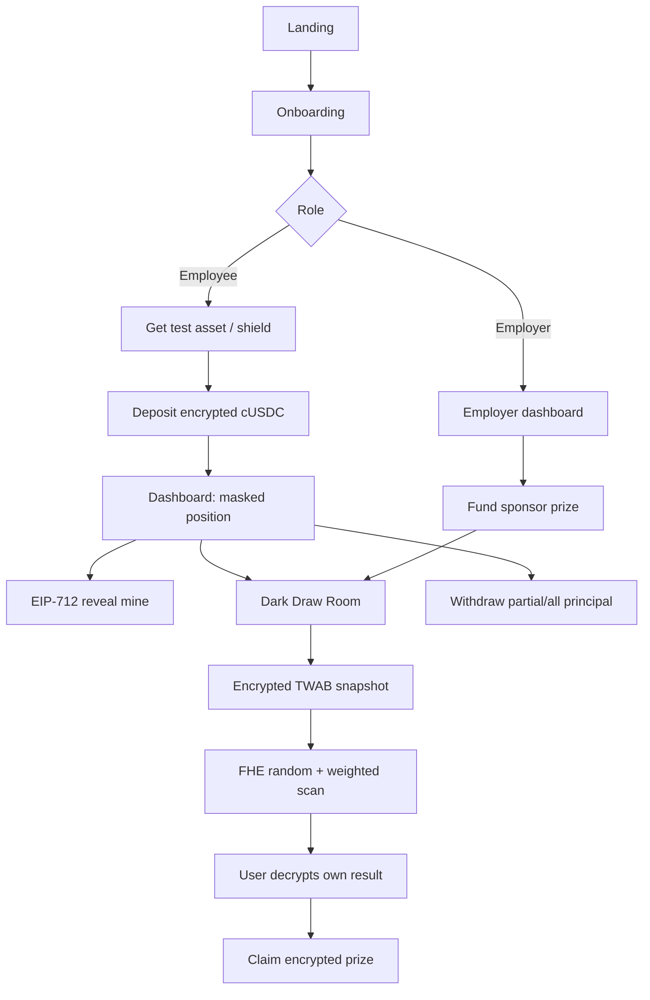
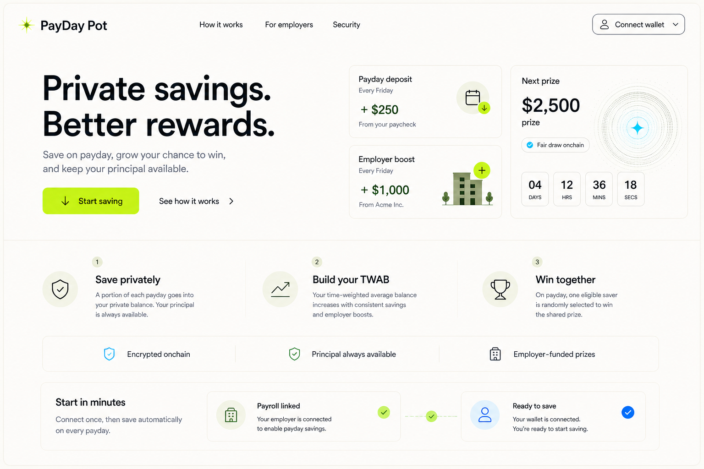
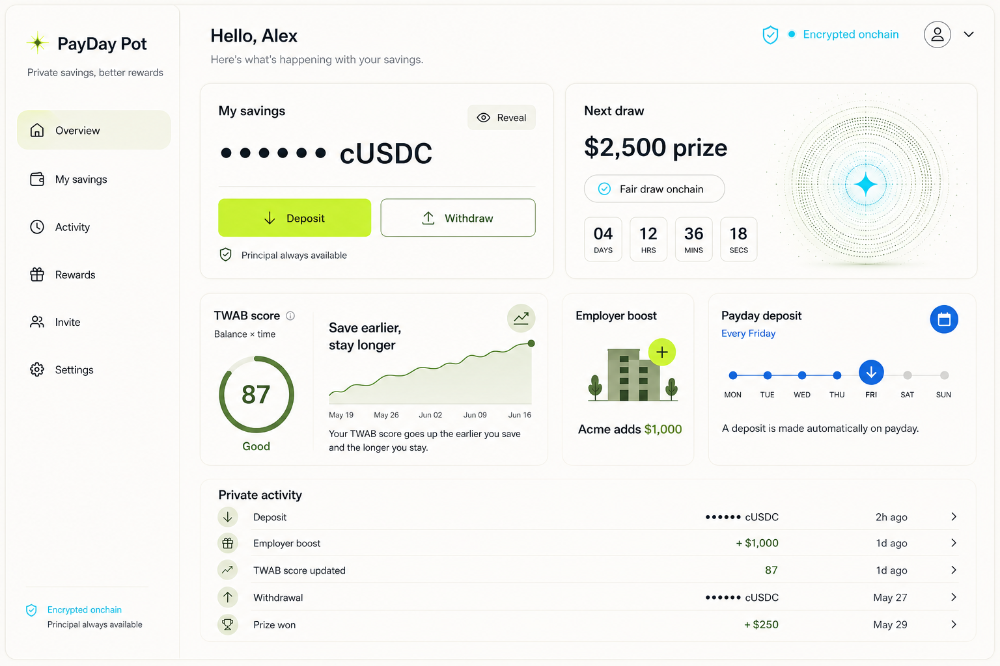
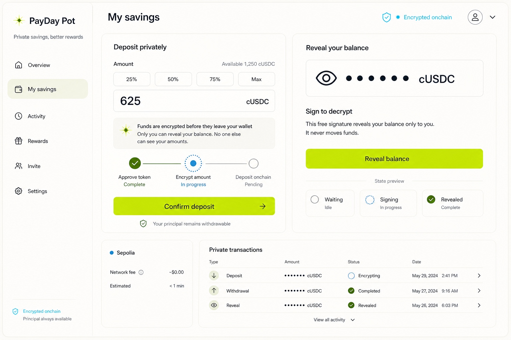
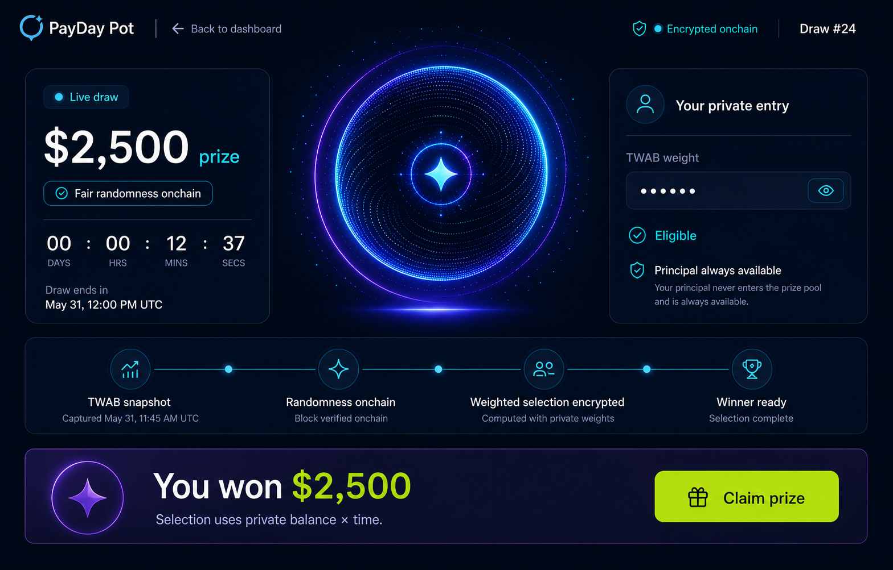
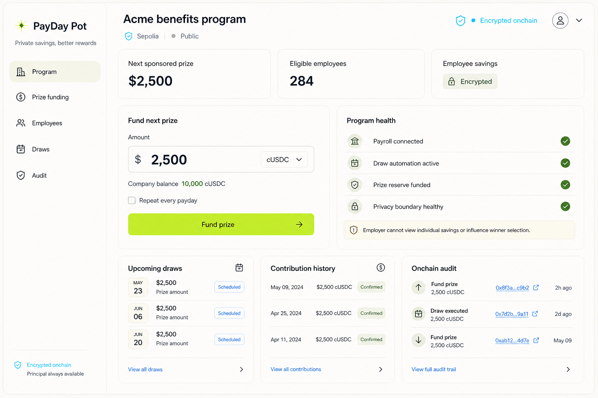
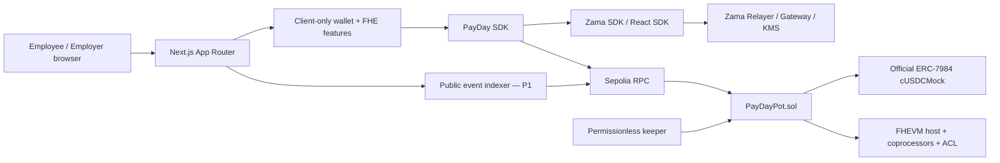

# PayDay Pot — Product, UX & Implementation Plan

> **Trạng thái:** Implementation-ready specification v1.0  
> **Mạng mục tiêu:** Ethereum Sepolia  
> **Tài sản demo:** official `cUSDCMock` / ERC-7984 confidential wrapper  
> **Deadline Season 4:** 05/09/2026 23:59 AOE — tương đương 06/09/2026 18:59 ICT  
> **Internal freeze:** 04/09/2026 18:00 ICT  
> **Tagline:** *Private savings. Better rewards.*

Tài liệu này là nguồn chuẩn để product, design, frontend, smart-contract, QA và người quay demo triển khai cùng một sản phẩm. Mọi thay đổi làm sai privacy boundary, no-loss invariant hoặc full onchain cycle phải được ghi vào Decision Log trước khi code.

---

## Mục lục định hướng

- **Product & scope:** Sections 1–6
- **Five-screen UX specification:** Sections 7–11
- **Shared UX system, components, tokens và privacy:** Sections 12–15
- **Runtime, contracts, TWAB/FHE draw và frontend:** Sections 16–20
- **Repository, testing, security, delivery và operations:** Sections 21–29
- **Glossary và official references:** Sections 30–31

---

## 1. Executive summary

PayDay Pot là confidential prize-savings pool do employer tài trợ giải thưởng:

- Nhân viên gửi `cUSDC` vào pool; số tiền gửi, số dư, TWAB và winnings được mã hóa.
- Cơ hội thắng được tính theo **TWAB — time-weighted average balance**: tiết kiệm nhiều hơn và lâu hơn thì weight cao hơn.
- Employer tài trợ prize reserve riêng; principal của nhân viên không bao giờ bị dùng làm giải.
- Winner selection chạy onchain bằng FHE randomness trên encrypted weights; không có offchain RNG hoặc plaintext balances.
- User ký EIP-712 để tự giải mã balance, TWAB và winnings của chính mình trong browser.
- Principal rút được đầy đủ bất kỳ lúc nào, kể cả khi draw đang snapshot hoặc xử lý.

### Product sentence cho người Web2

> Mỗi kỳ lương, bạn để tiền vào một hũ tiết kiệm riêng tư. Tiền vẫn thuộc về bạn và rút được bất kỳ lúc nào. Công ty tài trợ giải thưởng; người tiết kiệm đều đặn có cơ hội thắng cao hơn nhưng không ai nhìn thấy số tiền của nhau.

### Lý do sản phẩm cần FHE

Blockchain thường công khai số dư và lượng gửi, khiến người khác suy ra tài sản, salary cadence và odds. PayDay Pot giữ các con số đó encrypted nhưng vẫn cộng, so sánh và chọn người thắng onchain. Đây không chỉ là “ẩn số trên UI”; contract thực sự tính trên ciphertext.

---

## 2. Quyết định phạm vi

### 2.1 P0 — bắt buộc cho submission

- Một pool, một employer sponsor, một token `cUSDCMock`.
- Open enrollment cho demo; participant cap ban đầu 32, chỉ nâng sau HCU benchmark.
- Weekly-style epoch; demo deployment dùng epoch ngắn để quay video.
- Full flow: faucet/shield → deposit → EIP-712 reveal → draw → reveal result → claim → withdraw.
- Employer-funded Sepolia prize reserve; README gọi đúng là sponsored-yield simulator.
- Encrypted TWAB và encrypted deposit-weighted selection.
- Permissionless draw trigger và permissionless batch continuation.
- Frontend responsive, error recovery, direct-RPC source of truth.
- Public GitHub, verified Sepolia contract, public website và 3-minute real-person demo.

### 2.2 P1 — production candidate

- Employer allowlist hoặc Merkle invite.
- `claimFor`/batch claim để giảm winner timing inference.
- Public event indexer làm cache; app vẫn hoạt động khi indexer down.
- Fairness Receipt chi tiết theo draw.
- Monitoring keeper/relayer/RPC và automated Sepolia smoke test.
- Multisig employer funding flow.

### 2.3 P2 — chỉ làm sau khi P0/P1 ổn định

- Multi-employer/multi-pool.
- Real confidential yield adapter.
- Recurring payroll auto-deposit với operator permission có expiry và revoke.
- Multiple prizes/tiers.
- Account abstraction/relayed claim để giảm metadata linkage.

### 2.4 Không nằm trong submission

- Không gọi payroll auto-deposit là “live” nếu chưa có operator consent và keeper thật.
- Không xây lending protocol hoặc yield strategy mới.
- Không public leaderboard, employee ranking hoặc company surveillance dashboard.
- Không public-decrypt total balance, individual weights, random ticket hoặc winner.
- Không hứa anonymous address; sản phẩm bảo mật amount/balance/result, không che toàn bộ transaction graph.

### Copy corrections so với mockup

| Mockup hiện tại | Copy P0 phải dùng | Lý do |
|---|---|---|
| `Payday deposit — Every Friday` | `Next payday reminder — Every Friday` | P0 chưa tự động pull payroll funds. |
| `Payroll connected` | `Employer program connected` | Tránh tuyên bố integration chưa tồn tại. |
| `TWAB score 87` | `Your TWAB — Building` hoặc số TWAB sau local reveal | Không biến score tùy ý thành odds/rank. |
| `Winner stays private` | `Winnings stay encrypted; address/timing remain public` | Claim tx có thể tạo side channel. |

---

## 3. Success criteria và non-negotiables

### Product success

- Người mới hiểu “save, keep principal, win sponsor prize” trong dưới 30 giây.
- Judge hoàn thành full onchain cycle trong dưới 3 phút.
- Không cần hiểu `euint64`, ACL hoặc ciphertext để dùng happy path.
- Một lỗi RPC/relayer/indexer không làm mất draft hoặc tạo giao dịch trùng.

### Technical success

- Deposit accounting dùng **actual encrypted amount transferred**, không dùng requested amount.
- TWAB chốt đúng tại `epochEnd`; delayed draw không cộng thêm thời gian.
- Một draw chỉ có một encrypted winner khi total weight > 0; không reroll.
- Prize payout không bao giờ giảm principal liability.
- Mọi ciphertext mới đều cấp lại ACL đúng cho contract và owner.
- Decrypted value chỉ tồn tại trong browser memory và bị xóa khi hide, timeout, account/chain change hoặc reload.

### Non-negotiables

1. `withdrawAll()` luôn khả dụng; pause không được chặn withdraw hoặc claim.
2. Employer không có ACL đọc employee principal, TWAB hoặc winnings.
3. Keeper chỉ cung cấp liveness; không truyền random seed, weight hoặc winner.
4. Không có admin sweep principal.
5. Không emit plaintext amount hoặc winner address event.
6. Không gọi multiple sequential transactions là atomic/one-click.
7. UI không hiển thị `0` khi một confidential value chỉ đang hidden/unavailable.

---

## 4. Season 4 requirement traceability

| Yêu cầu chính thức | PayDay Pot implementation | Evidence phải có trước submit |
|---|---|---|
| Public web dApp | Next.js app trên public HTTPS URL | Incognito smoke test |
| Smart contract + frontend | Public monorepo | GitHub link + release tag |
| Full onchain cycle | Deposit → draw → claim → withdraw | E2E test + video + tx links |
| Encrypted deposits/balances | ERC-7984 transfer + `euint` accounting | Contract source + user-decrypt demo |
| Onchain FHE randomness | `FHE.randEuint64()` trong draw transaction | Verified source + draw tx |
| Deposit-weighted encrypted winner | Encrypted TWAB + multiply-high ticket + cumulative scan | Math doc + property tests |
| No offchain RNG/plaintext balance | Keeper chỉ trigger/process batches | Architecture + negative tests |
| No loss | Principal ledger tách prize; `withdrawAll()` mọi phase | Invariants + demo |
| EIP-712 decryption | Balance, TWAB và winnings user-decrypt | UI + video |
| Draw automation/admin flow | Permissionless trigger + keeper docs + manual fallback | Runbook |
| Faucet/instructions | Mock USDC mint → shield cUSDC | `/faucet` hoặc onboarding guide |
| Public GitHub | Source, tests, scripts, docs | Signed-out verification |
| Leakage documented | Dedicated privacy table + UI disclosure | README/PRIVACY.md |
| Video ≤3 phút | Real person, normal speed, X/YouTube/Loom | Final link |
| Project name rule | `PayDay Pot` không chứa “Zama” | Submission form |

Judging alignment:

- **Correctness:** invariant tests và full-cycle Sepolia smoke.
- **Confidentiality design:** explicit data boundary; encrypted selection không decrypt total/winner.
- **UX:** five-screen journey, recoverable approvals/errors và local reveal.
- **Code quality:** typed monorepo, pinned versions, NatSpec, architecture docs.
- **Production-readiness:** permissionless liveness, verified contract, monitoring và incident states.

---

## 5. Personas và privacy expectations

| Persona | Job to be done | Nỗi lo chính | Quyền tuyệt đối không có |
|---|---|---|---|
| Employee saver | Gửi tiền, theo dõi TWAB, xem kết quả, claim và rút principal | Salary/savings/odds bị lộ; chữ ký khó hiểu | Không đọc dữ liệu người khác |
| First-time Web2 user | Hiểu sản phẩm và vào được first deposit | Wallet, network, gas, FHE jargon | Không bị auto-decrypt/auto-approve |
| Employer sponsor | Tài trợ giải và xem trạng thái chương trình | Solvency, lịch draw, audit trail | Không đọc employee balance/TWAB/winnings; không chọn winner |
| Keeper/operator | Trigger và tiếp tục draw đúng hạn | Liveness, retry, batch cursor | Không đưa seed hoặc reroll |
| Judge/tester | Chạy full flow nhanh và xác minh bằng tx/source | Faucet, lỗi mạng, unclear privacy claims | Không cần setup riêng ngoài hướng dẫn |

---

## 6. Information architecture và routes

```text
Public
├── /                              Landing
├── /onboarding                   Role/wallet/network/assets/enrollment
├── /draws/[drawId]/proof         Public Fairness Receipt
├── /learn                        TWAB, FHE và privacy boundary
└── /faucet                       Test asset instructions

Employee
├── /app                           Dashboard
├── /app/savings                   Deposit / Withdraw / Reveal / History
└── /app/draws/[drawId]            Dark Draw Room / Result / Claim

Employer
├── /employer                      Sponsor overview
├── /employer/funding              Fund reserve
├── /employer/campaigns            Prize schedule
└── /employer/audit                Public onchain audit
```

### Route guards

- `/app/**`: wallet connected + Sepolia + employee enrollment.
- `/employer/**`: wallet connected + Sepolia + sponsor role.
- Wrong role hiển thị access page, không redirect âm thầm sang persona khác.
- Reconnect giữ `returnTo` và public step state; monetary draft và decrypted memory bị xóa.
- Query string chỉ chứa tên panel/step; không chứa amount, handle, result hoặc invite secret dài hạn.

### End-to-end journey



---

## 7. Screen 1 — Landing & Onboarding



### Goal

- Visitor hiểu value proposition trong dưới 30 giây.
- Employee hoặc employer hoàn tất wallet/network/role setup mà không cần biết FHE internals.
- Privacy consent trung thực trước transaction đầu tiên.

### Page structure

| Khu vực | Component | Nội dung/chức năng |
|---|---|---|
| Header | `PublicHeader` | Logo, How it works, For employers, Security, Sepolia, Connect wallet |
| Hero | `Hero` | Promise, short explanation, Start saving, Sponsor a pot |
| Live proof | `PublicDrawPreview` | Public prize, next draw, status; không TVL/odds |
| Education | `HowItWorks` | Save privately → Build TWAB → Win together |
| Privacy | `PrivacyBoundaryComparison` | Hidden vs public/linkable data |
| No-loss | `PrincipalPromise` | Snapshot weight, không lock funds |
| Employer | `EmployerBenefitPanel` | Sponsor prize mà không thấy employee balances |
| Onboarding | `OnboardingStepper` | Role → wallet → network → program → assets → review → success |
| Footer | `RiskDisclosure` | Testnet, unaudited, no guaranteed win/yield |

### Onboarding steps

1. **Choose role:** Employee hoặc Employer bằng accessible radio cards.
2. **Connect wallet:** connect, checksum address, detect EIP-712 capability.
3. **Switch network:** Sepolia; preserve role and return route.
4. **Connect program:** P0 demo enrollment; P1 invite/Merkle proof.
5. **Privacy consent:** amount/balance/result encrypted; address/time/tx graph public.
6. **Asset readiness:** detect cUSDC; show mint mock USDC và shield instructions.
7. **Review:** contract, network, role, public/private fields, approvals.
8. **Enroll:** submit, confirm, sync; success CTA theo role.

### Required data

- Public draw/prize/schedule and contract version.
- Wallet address, chain ID, signer compatibility.
- Enrollment/role status.
- Token/wrapper registry status and faucet readiness.
- Approval/operator status; never decrypt balance automatically.

### States

| State | Required UX |
|---|---|
| Public data loading | Hero renders immediately; draw preview skeleton only |
| No active draw | `First payday pot opens soon`; CTA vẫn hoạt động |
| Wallet disconnected | Explain why connect/signing is needed |
| Wrong network | Blocking Sepolia panel + one-click switch + manual guide |
| Existing enrollment | Open correct dashboard, không submit duplicate |
| Invalid/expired invite | Inline recovery; không xác nhận membership của arbitrary address |
| Unsupported wallet | Compatibility explanation, không silent fail |
| Approval rejected | Stay on review; safe retry; no error alarm |
| Tx pending after refresh | Restore by tx hash and onchain receipt |
| Indexer lag | Show confirmed receipt, continue direct-RPC polling |
| Success | Focus success heading; CTA First deposit/Fund prize |

### Responsive & accessibility

- Mobile: one task per onboarding screen; sticky primary CTA; comparison thành accordions.
- Desktop: 60/40 hero; onboarding content max 880px.
- Một H1, logical heading order, focus moves to new step heading.
- Progress announces `Step n of 8`; errors have summary and field associations.
- Privacy consent không prechecked; UI hoạt động tại 320px và 200% zoom.
- Countdown có absolute time; không announce mỗi giây.

### Acceptance criteria

- [ ] Role/invite state survive wallet and network changes without persisting sensitive data.
- [ ] Public page remains useful if wallet/FHE SDK fails to load.
- [ ] No confidential value is auto-decrypted.
- [ ] Privacy disclosure lists address, timing, tx graph and claim linkage as public.
- [ ] Approval, action, confirmation and sync are separate recoverable states.
- [ ] Keyboard-only and mobile onboarding complete successfully.

---

## 8. Screen 2 — Employee Dashboard



### Goal

Cho returning employee biết ba điều ngay lập tức: tiền của mình đang private, kỳ draw tiếp theo khi nào, và hành động Deposit/Withdraw ở đâu.

### Route

`/app`

### Page structure

| Khu vực | Component | Chức năng |
|---|---|---|
| App shell | `EmployeeAppHeader` | Program, network, wallet, encrypted status |
| Position | `PrivatePositionCard` | Masked principal/TWAB; reveal bundle; hide/expiry |
| Draw hero | `NextDrawHero` | Public prize, draw ID, cutoff, countdown, Draw Room CTA |
| Actions | `QuickActions` | Deposit, Withdraw, History |
| TWAB | `TwabCard` | Client-local visualization; không public rank/odds |
| Sponsor | `EmployerBoostCard` | Public sponsor allocation |
| Rhythm | `PaydayReminderCard` | Reminder only trong P0; không claim auto-deposit |
| Activity | `PrivateActivityList` | Public type/time/hash; amount masked |
| Privacy | `RevealSessionStrip` | TTL, hide all, what is linkable |

### User actions

- Reveal/hide balance và TWAB của chính mình.
- Deposit, withdraw, open Draw Room.
- Open explorer receipt và retry sync.
- Enable local payday reminder; no server-side monetary schedule in P0.

### States

| State | Required UX |
|---|---|
| Loading | Public cards skeleton; private values masked, never `0` |
| First-time saver | First deposit CTA; draw still visible |
| No active draw | Savings actions remain available |
| Reveal signing/decrypting | Per-field progress; rest of page usable |
| Reveal rejected | Remain masked; `Nothing was revealed or sent` |
| Stale ciphertext handle | Remask, refetch latest block, offer new reveal |
| Pending deposit/withdraw | Pinned transaction card, no optimistic plaintext balance |
| Result ready | Neutral `Your result is ready`; no winning cue |
| Partial RPC failure | Section-level retry, not blank full page |
| Wrong role/network | Blocking guard with safe recovery |

### Responsive & accessibility

- Mobile order: draw → private position → actions → TWAB → activity.
- Desktop 12-column grid: position 5, draw 7; activity full-width.
- Masked fields announce `Balance hidden`, not six bullets.
- Revealed numbers use tabular numerals and full currency accessible text.
- Result-ready banner uses polite `status`; no outcome in accessible name.
- Activity table becomes labelled cards on mobile.

### Acceptance criteria

- [ ] First paint, refresh and new tab always start masked.
- [ ] Reveal clears on hide, TTL, account change, chain change and reload.
- [ ] Snapshot copy confirms principal remains withdrawable.
- [ ] Result-ready UI is outcome-neutral before local reveal.
- [ ] No analytics event/property includes plaintext or winner state.
- [ ] Section failures do not block unrelated deposit/withdraw actions.

---

## 9. Screen 3 — My Savings: Deposit, Withdraw & Reveal



### Goal

Biến confidential token flow thành banking flow rõ ràng, đồng thời không che giấu việc approval, encryption và onchain confirmation là các bước riêng.

### Routes

- `/app/savings`
- `/app/savings?action=deposit`
- `/app/savings?action=withdraw`
- `/app/savings?action=history`

Query chỉ lưu action; không bao giờ chứa amount, plaintext, handle hoặc proof.

### Page structure

| Khu vực | Component | Chức năng |
|---|---|---|
| Header | `SavingsHeader` | Encrypted by default, principal/TWAB explanation |
| Summary | `PrivateSavingsSummary` | Balance/TWAB masked; reveal bundle; block freshness |
| Tabs | `SavingsActionTabs` | Deposit, Withdraw, History; browser back hoạt động |
| Deposit | `DepositPanel` | Amount, token readiness, approval, encrypt, review, submit |
| Withdraw | `WithdrawPanel` | Partial hoặc `Withdraw all`; effect on future TWAB |
| Review | `TransactionReviewDialog` | Encrypted fields vs public/linkable metadata |
| Progress | `TransactionProgress` | Prepare → Encrypt → Wallet → Submit → Confirm → Sync |
| History | `SavingsHistory` | Type/time/hash public; amounts masked |
| Help | `SafetyAndHelpPanel` | No-loss promise, retries, contract links |

### Deposit flow

```text
Idle
→ check token/operator
→ approval required? approve and confirm
→ encrypt amount + input proof
→ review public/private boundary
→ wallet submit
→ onchain confirmation
→ fetch new ciphertext handle
→ success, value remains masked
```

Rules:

- Approval is not called deposit.
- Draft amount lives in component memory only.
- Ledger credits actual ciphertext transferred by ERC-7984 callback/return.
- Confirmation never auto-reveals updated balance.
- Token acquisition/shield is a separate privacy boundary; clear `wrap` amount may be public.

### Withdraw flow

```text
Choose partial amount OR Withdraw all
→ checkpoint TWAB at min(now, epochEnd)
→ encrypt request when partial
→ review future-weight effect
→ submit
→ transfer actual encrypted amount
→ confirm and refresh masked handle
```

Rules:

- `Withdraw all` works without first public-decrypting balance.
- Withdraw remains reachable during snapshot, draw delay, pause or employer inactivity.
- Withdrawal after cutoff changes next epoch, not frozen weight.
- Privacy-safe failure message must not reveal the available balance.

### Reveal flow

```text
Masked
→ check handle and ACL
→ show EIP-712 consent scope/expiry
→ wallet signature
→ SDK/KMS user decrypt
→ plaintext in tab memory
→ manual hide or TTL expiry
→ Masked
```

### States

| State | Required UX |
|---|---|
| No savings | First deposit CTA; history empty, not error |
| No test token | Faucet/shield guide; withdraw/reveal stay available |
| Approval required | Separate spender/scope/expiry step |
| Encrypting | Explicit label; cancellation before wallet submit |
| Signature rejected | Draft retained in tab; no transaction sent |
| Relayer unavailable | Preserve draft in memory; diagnostics + retry |
| Insufficient native gas | Distinguish from confidential token balance |
| Possible insufficient principal | Generic failure; suggest local reveal or smaller amount |
| Tx pending | Prevent duplicate; safe leave with tx hash |
| Confirmed, state syncing | Receipt success; old handle marked stale |
| Stale ACL/handle | Refetch and request fresh signature |
| Success | Masked summary + optional `Reveal updated balance` |
| Offline | Stale public shell; disable monetary writes |

### Responsive & accessibility

- Mobile: full-height sheets, sticky CTA, virtual keyboard cannot cover amount field.
- Desktop: 5/7 split; forms max 560px; history full width.
- Amount input uses decimal input mode, visible token/decimal label and associated errors.
- Stepper is ordered list with `aria-current=step`; errors receive focus.
- Masked plaintext must also be absent from accessibility tree.

### Acceptance criteria

- [ ] Plaintext/draft never appears in SSR, URL, storage, analytics, logs or notifications.
- [ ] Account/network change clears draft, reveal session and polling.
- [ ] Deposit exposes every distinct transaction phase and prevents duplicates.
- [ ] `Withdraw all` is available in every draw lifecycle state.
- [ ] `Max` first asks for local reveal; it never infers a masked balance.
- [ ] After mutation, updated value stays masked until explicit reveal.
- [ ] All rejection, stale-handle, sync-lag and offline paths have recovery.

---

## 10. Screen 4 — Dark Draw Room & Claim



### Goal

Tạo cao trào cho demo nhưng vẫn là verifiable product state: public theo dõi draw lifecycle, mỗi user tự decrypt kết quả, winner claim encrypted prize onchain.

### Routes

- `/app/draws/current`
- `/app/draws/[drawId]`
- `/draws/[drawId]/proof` — public, shareable, không có private result control.

### Draw state machine

```text
OPEN
→ SNAPSHOTTING
→ RANDOMNESS_READY
→ SELECTING_BATCHES
→ FINALIZED
→ RESULT_READY
→ CLAIMABLE
→ CLAIMED

Any processing phase → FAILED/STALE with deterministic recovery
```

### Page structure

| Khu vực | Component | Chức năng |
|---|---|---|
| Header | `DrawRoomHeader` | Draw ID, public prize, encrypted-onchain status |
| Stage | `EncryptedDrawOrb` | Atmosphere only; never source of truth |
| Timeline | `DrawPhaseTimeline` | Snapshot, RNG tx, selection cursor, finalized evidence |
| Entry | `PrivateEntryCard` | TWAB masked; principal available copy |
| Result | `SealedResultCard` | Neutral before EIP-712 reveal; winner/loser local state |
| Proof | `FairnessReceipt` | Contract, blocks, txs, algorithm, what proof does/doesn't prove |
| Claim | `ClaimReviewDialog` | Encrypted amount vs public address/time/tx |
| Receipt | `ClaimReceipt` | Onchain status and explorer link |

### Result and claim flow

1. Public draw reaches `FINALIZED`; UI receives encrypted winnings handle.
2. Result card stays neutral and sealed.
3. User chooses `Check my result` and signs draw/address/handle-scoped EIP-712 request.
4. Local result:
   - zero → private non-winner treatment;
   - positive → private winner treatment + Claim CTA.
5. Claim review warns that address and timing are public/linkable.
6. `claim()` transfers encrypted pending prize and resets liability.
7. Refresh reseals amount; receipt remains public.

### States

| State | Required UX |
|---|---|
| Scheduled | Countdown + cutoff; result sealed |
| Snapshotting | Eligibility frozen; principal still withdrawable |
| Randomness pending | Public tx/status; no fabricated ETA |
| Selecting batches | Cursor/progress public; weights/winner hidden |
| Result ready, handle syncing | Sealed `Preparing your private result` + retry |
| Ready, unrevealed | Identical DOM/layout for winner and loser |
| Reveal rejected/failed | `Your result remains hidden`; safe retry |
| Revealed zero | Local-only next-draw CTA; no outcome telemetry |
| Revealed positive | Local amount + claim readiness |
| Claim not open | Opening timestamp; CTA disabled |
| Claim pending | Prevent duplicate; show tx hash |
| Already claimed | Reconcile onchain and show known receipt |
| Proof invalid | Critical incident; claim disabled; evidence link |
| Offline/RPC stale | Mark cached state stale; disable reveal/claim |

### Responsive & accessibility

- Mobile order: status → sealed result → CTA → proof; timeline vertical.
- Desktop 7/5 split; proof full-width below.
- Dark theme meets WCAG AA; glow never conveys state alone.
- Countdown announces meaningful phase changes only.
- Before reveal, outcome absent from visible DOM, accessible names, notifications and analytics.
- Winner motion is optional, non-flashing and disabled by `prefers-reduced-motion`.

### Acceptance criteria

- [ ] Winner/non-winner cannot be inferred from UI/network payload intended for UI before reveal.
- [ ] EIP-712 request is bound to user, contract, draw and current handle.
- [ ] Claim unavailable until draw finalized, result locally positive and claim window open.
- [ ] Claim review explicitly discloses address/time/tx metadata.
- [ ] Public proof exposes fairness evidence without plaintext weights/result.
- [ ] Principal withdrawal remains reachable throughout the draw.
- [ ] No outcome-specific analytics/logging exists.
- [ ] Reduced-motion, keyboard and screen-reader flows pass.

---

## 11. Screen 5 — Employer Sponsor Dashboard



### Goal

Employer tài trợ prize, lập lịch chương trình và kiểm tra audit trail mà không trở thành người custody principal hoặc công cụ giám sát employee savings.

### Routes

- `/employer`
- `/employer/funding`
- `/employer/campaigns`
- `/employer/invites` — P1
- `/employer/audit`

### Page structure

| Khu vực | Component | Chức năng |
|---|---|---|
| Header | `EmployerHeader` | Org, admin role, wallet/network |
| Metrics | `SponsorOverviewCards` | Public next prize/count; reserve masked if encrypted |
| Funding | `FundPrizePanel` | Approve/shield/transfer/review/confirm |
| Campaign | `PrizeCampaignComposer` | Prize, draw, schedule, employee-facing preview |
| Health | `ProgramHealth` | Program, permissionless draw, reserve, privacy checks |
| Draws | `UpcomingDraws` | Public schedule and lifecycle |
| History | `ContributionHistory` | Public allocated prizes; confidential reserve stays masked |
| Audit | `PublicAuditLog` | Actor, action, time, tx, contract version |
| Privacy | `EmployerBoundaryNotice` | Cannot view individual savings or influence winner |

### Employer rules

- Published prize amount và schedule là public; disclosure appears before signature.
- Unallocated sponsor reserve may remain encrypted and employer-only decryptable.
- Employee handles/ACL are never returned to employer APIs or role.
- Employer cannot reduce a locked prize, reroll, freeze withdrawal or sweep principal.
- P0 supports one sponsor wallet; P1 maps roles/multisig and invite lifecycle.
- Analytics are aggregate/public only; no individual behavioral roster.

### Funding flow

```text
Draft amount
→ token/operator readiness
→ approval or shield if needed
→ review what becomes public
→ fund reserve / allocate epoch prize
→ confirm tx
→ program health and audit update
```

### States

| State | Required UX |
|---|---|
| Unauthorized/viewer | Read-only public view; controls server/contract-enforced, not CSS-hidden |
| No reserve | Funding CTA; composer explains prerequisite |
| Reserve masked | No low-balance inference from conditional UI |
| Approval required | Explicit spender/scope step |
| Funding pending | Tx hash, duplicate prevention, state sync |
| No campaign | Real sample preview + Create first campaign |
| Invalid allocation | Privacy-safe validation and field errors |
| Awaiting multisig | `Awaiting approvals`, never falsely `Published` |
| Scheduled | Public amount/date/tx visible |
| Draw locked | Immutable; edit/cancel disabled with cutoff |
| Concurrent admin change | Version mismatch, reload diff, fresh review |
| Contract/RPC incident | Stale badge; unsafe mutations disabled |
| Success | Specific receipt; no confidential amount in toast |

### Responsive & accessibility

- Mobile tables become cards; campaign composer becomes steps; sticky safe-area CTA.
- Desktop: composer 7 columns + live preview 5; audit full width.
- Charts require text/table equivalents and small-cohort suppression.
- Reserve accessible name says `Sponsor reserve hidden`; no plaintext in tree.
- Time controls show UTC and local timezone; keyboard-operable calendar.
- Destructive future-campaign actions name exact scope.

### Acceptance criteria

- [ ] Employer role cannot fetch/decrypt/export employee financial data.
- [ ] Published amount/schedule disclosure is explicit before signing.
- [ ] Funding phases are distinct and recoverable.
- [ ] No employer control blocks or redirects principal withdrawal.
- [ ] Locked draw cannot be edited, cancelled or rerolled.
- [ ] Audit export contains only declared public metadata.
- [ ] Negative authorization tests cover each employer role.
- [ ] Mobile, keyboard, screen reader and 200% zoom pass.

---

## 12. Shared interaction state machines

Các state machine này là contract giữa UI, SDK và onchain state. Không collapse nhiều phase thành một spinner vì user cần biết đang chờ browser, wallet, chain hay relayer.

### 12.1 Reveal

```text
MASKED
→ SDK_INITIALIZING
→ ACL_CHECKING
→ AWAITING_EIP712_SIGNATURE
→ DECRYPTING
→ REVEALED
→ HIDDEN / EXPIRED

Any pre-reveal phase → REJECTED / STALE_HANDLE / ERROR → MASKED
```

### 12.2 Monetary transaction

```text
DRAFT
→ TOKEN_CHECK
→ APPROVAL_REQUIRED? → APPROVING → APPROVAL_CONFIRMING
→ ENCRYPTING
→ REVIEW
→ AWAITING_WALLET
→ SUBMITTED
→ CONFIRMING
→ PRIVATE_STATE_SYNC
→ COMPLETE

Any phase → REJECTED / REVERTED / TIMEOUT / ERROR → recoverable prior phase
```

### 12.3 Draw

```text
OPEN
→ SNAPSHOTTING batches
→ RANDOM_GENERATED once
→ SELECTING batches
→ FINALIZED
→ RESULT_READY
→ CLAIMABLE
→ CLAIMED
```

Public draw progress may be cached; contract status/cursor is authoritative. A refresh resumes from onchain state, never restarts the draw.

### 12.4 Suggested shared types

```ts
type TxPhase =
  | 'draft'
  | 'checking_token'
  | 'approving'
  | 'approval_confirming'
  | 'encrypting'
  | 'review'
  | 'awaiting_wallet'
  | 'submitted'
  | 'confirming'
  | 'syncing_private_state'
  | 'complete'
  | 'rejected'
  | 'error';

type RevealPhase =
  | 'masked'
  | 'sdk_initializing'
  | 'checking_acl'
  | 'awaiting_signature'
  | 'decrypting'
  | 'revealed'
  | 'expired'
  | 'stale_handle'
  | 'error';

type DrawPhase =
  | 'open'
  | 'snapshotting'
  | 'random_ready'
  | 'selecting'
  | 'finalized'
  | 'claimable'
  | 'closed';

interface CiphertextRef {
  handle: `0x${string}`;
  contractAddress: `0x${string}`;
  updatedAtBlock: bigint;
  owner: `0x${string}`;
}
```

---

## 13. Shared component specifications

### 13.1 `ConfidentialValue`

**Purpose:** hiển thị một encrypted value masked by default và quản lý reveal/hide lifecycle.

```ts
interface ConfidentialValueProps {
  label: string;
  valueRef?: CiphertextRef;
  symbol?: string;
  decimals?: number;
  revealGroup?: 'position' | 'result' | 'reserve';
  expiresAt?: number;
  onReveal(): Promise<void>;
  onHide(): void;
}
```

| State | Visual | Behavior |
|---|---|---|
| Masked | `••••••`, eye + Reveal | Plaintext absent from DOM/a11y tree |
| Signing | Signature label + progress | Cancel only by rejecting wallet |
| Decrypting | Cyan processing status | No stale plaintext displayed |
| Revealed | Value + Hide + expiry | Memory-only |
| Stale | Masked + Refresh | Fetch newest handle first |
| Error | Masked + specific recovery | Never expose balance through error wording |

Accessibility: accessible label says `<label> hidden`; reveal completion announced politely without reading the number until focus enters the value.

### 13.2 `TransactionProgress`

**Purpose:** communicate multi-transaction and async FHE progress.

- Ordered list with `aria-current="step"`.
- Each confirmed onchain phase exposes explorer link.
- Failure belongs to exact phase and has local retry.
- Refresh rebuilds progress from approval, tx receipt and contract state.
- Spinner is supplementary; every state has text.

### 13.3 `SensitiveAmountInput`

**Purpose:** accept amount locally without persistence or telemetry.

- Decimal input, token/decimals visible, paste supported.
- `25/50/75/Max` only enabled after the source balance has been locally revealed.
- Clear on cancel, success, timeout, account/chain change and route leave.
- Never log value through validation/error reporting.
- Mobile numeric keyboard; hit targets ≥44×44px.

### 13.4 `PrivacyBoundaryNotice`

Variants:

- `compact`: encrypted/public badges.
- `transaction-review`: field-by-field classification.
- `claim-warning`: address/time/tx linkage.
- `shield-warning`: public ERC-20 wrap amount boundary.

Every semantic state uses icon + text; color is secondary.

### 13.5 `PublicDrawCard`

Data: draw ID, public prize, cutoff, next action time, phase, cursor, tx links.

States: no draw, scheduled, snapshotting, selecting, finalized, delayed, failed. Countdown includes a static absolute date and does not create per-second screen-reader announcements.

### 13.6 `FairnessReceipt`

Shows:

- verified contract and source commit;
- epoch start/end and snapshot cutoff;
- participant count/cap;
- RNG transaction;
- snapshot and selection batch transactions/cursor;
- algorithm explanation and privacy boundary;
- explicit statement that principal never enters prize reserve.

It does **not** show total plaintext weight, individual weight, random ticket or winner.

### 13.7 `ReviewTransactionDialog`

- Focus trap; focus returns to trigger.
- Escape closes only before external wallet request.
- Sections: Action, Encrypted/private, Public/linkable, Network/contract, Estimated gas.
- Confirm button changes to exact verb: `Deposit`, `Withdraw`, `Fund prize`, `Claim prize`.
- No misleading success state until receipt confirms and private state sync completes.

### 13.8 `AppShell` and guards

- Skip link, `aria-current` navigation, full accessible wallet address.
- Global `NetworkGuard`, `RoleGuard`, `SdkHealth`, `TransactionCenter`.
- Mobile bottom navigation; desktop left rail.
- Confidential client components never render through SSR.

---

## 14. Design system

### 14.1 Theme strategy

- Default product shell: quiet-luxury light theme.
- Draw Room only: controlled dark theme.
- CSS variables + Tailwind semantic tokens; components never hardcode raw brand colors.

### 14.2 Color tokens

```css
:root {
  --bg-canvas: #F5F2EA;
  --bg-surface: #FFFFFF;
  --bg-subtle: #F0EEE6;
  --fg-default: #121514;
  --fg-muted: #66706C;
  --border-default: #DDD9CF;

  --action-primary: #C8F24A;
  --action-primary-hover: #B7E33A;
  --action-primary-active: #A5CF2D;
  --action-on-primary: #10120B;

  --privacy: #31D8FF;
  --privacy-subtle: #EAFBFF;
  --success: #2F7D32;
  --warning: #A86812;
  --danger: #C93D3D;

  --draw-canvas: #06111E;
  --draw-surface: #0B1A2A;
  --draw-border: #193047;
  --draw-violet: #8B5CF6;
}
```

Rules:

- Chartreuse = primary action, không dùng làm decoration khắp nơi.
- Cyan = encrypted/FHE processing, không đồng nghĩa success.
- Green = confirmed/success.
- Amber = public/linkable warning.
- Red = destructive hoặc unrecoverable error.
- Contrast: 4.5:1 normal text, 3:1 large text/UI boundaries.

### 14.3 Typography

- Sans: Geist Sans hoặc Inter fallback.
- Tabular numerals cho monetary/countdown values.
- Scale: 12, 14, 16, 18, 20, 24, 32, 48, 64px.
- Body minimum 16px trong forms; helper minimum 14px.
- Landing có một H1; app pages có một H1 và logical H2/H3.

### 14.4 Layout

- 4px base spacing; primary rhythm 8/12/16/24/32/48/64.
- Container max 1400px; desktop dashboard 12 columns.
- Form reading width 560–640px.
- Radius: controls 12px, cards 20px, sheets 24px.
- Shadows rất nhẹ; border là primary separation.
- Hit target tối thiểu 44×44px.

### 14.5 Motion

- Hover/focus: 150ms.
- Panel/sheet: 220–300ms.
- Draw orb: slow ambient loop, không chặn thao tác.
- `prefers-reduced-motion`: bỏ loop, confetti, parallax; giữ state transition tức thời.
- Không flashing và không animation làm lộ outcome trước reveal.

### 14.6 Responsive system

| Breakpoint | Behavior |
|---|---|
| `<640px` | One column, 16px gutters, full-height sheets, sticky safe-area CTA |
| `640–1023px` | Two-column cards khi hợp lý, forms centered max 640px |
| `≥1024px` | 12-column dashboard, left nav, forms vẫn giới hạn chiều rộng |
| `≥1536px` | Container max 1400px, không kéo form/card quá rộng |

---

## 15. Privacy boundary

### 15.1 Data classification

| Data | Onchain state | Ai được decrypt | UI default | Leakage/caveat |
|---|---|---|---|---|
| Deposit amount vào pool | Encrypted | User + contract | Masked | Tx sender/time public |
| Employee principal | Encrypted | User + contract | Masked | Address participation public |
| Total principal | Encrypted | Contract only | Không hiển thị | Small-pool timing may aid inference |
| TWAB area/weight | Encrypted | User + contract | Masked | Last checkpoint/time public |
| Total weight | Encrypted | Contract only | Không hiển thị | Never public-decrypt |
| Random `R` và ticket | Encrypted | Contract only | Proof status only | RNG call tx public |
| Winner flags | Encrypted | Contract only | Không hiển thị | Claim behavior may reveal linkage |
| Pending winnings | Encrypted | User + contract | Sealed | Claim address/time public |
| Sponsor unallocated reserve | Encrypted or sponsor-private | Sponsor + contract | Masked | Funding tx public |
| Published prize allocation | Public | N/A | Visible | Intentional disclosure |
| Epoch/schedule/status | Public | N/A | Visible | Required for fairness/liveness |
| Wallet/contract addresses | Public | N/A | Truncated but inspectable | Not an anonymity product |
| Mint/wrap/unshield amount | Public boundary | N/A | Warning before action | Can correlate with later pool tx |

### 15.2 Client data rules

- Decrypted values live in React/store memory only; never SSR, URL, cookies, localStorage, IndexedDB, service-worker cache, backend or analytics.
- Remask on explicit Hide, TTL (default 5 minutes), wallet/chain change, tab close/reload and handle mutation.
- Draft amount stays only in active component memory.
- Error monitoring scrubs address, handle, proof, signature, RPC request body and all monetary values.
- Clipboard action is explicit; no automatic balance copy.
- Browser notifications never include result, amount or winner status.

### 15.3 Metadata mitigation

- Events omit clear amount and winner identity.
- `claimFor(address)` may be permissionless so a keeper can process participants uniformly.
- UI encourages scheduled/batched claim rather than winner-only immediate call.
- Fairness page shows public proof without publishing participant financial values.
- README explicitly says employer may know employee wallet mapping outside the protocol and Ethereum activity remains public.

---

## 16. Runtime architecture



### Boundaries

- Public landing/draw metadata may use SSR/static rendering.
- Wallet, encryption, decryption, handles và monetary forms are client-only.
- Indexer stores public event metadata only; direct RPC is fallback/source of truth.
- Keeper has no special correctness authority.
- Relayer/API secrets, if required, stay server-side; never `NEXT_PUBLIC_*`.

---

## 17. Smart-contract architecture

### 17.1 P0 deployment set

```text
PayDayPot.sol                 Core non-upgradeable vault + TWAB + epochs + draw + claim
SepoliaSponsoredPrize.sol    Optional funding adapter / employer-funded reserve interface
MockUSDCFaucet.sol            Only if official faucet UX is insufficient
```

Prefer one core contract for encrypted state to reduce cross-contract ACL mistakes. Libraries may organize code but must not create hidden upgrade/admin surfaces.

### 17.2 Core roles

- `EMPLOYER_ROLE`: funds future prize; cannot inspect employee ciphertexts or reroll.
- `PAUSER_ROLE`: can pause new deposits/new draw start during incident; cannot pause withdraw/claim.
- No privileged keeper role: snapshot/draw batch functions are permissionless.
- Ownership uses `Ownable2Step` or explicit AccessControl; no principal sweep.

### 17.3 Conceptual state

```solidity
struct Account {
    euint64 principal;
    euint128 twabArea;
    uint64 lastCheckpoint;
    euint64 pendingPrize;
    bool registered;
}

enum EpochPhase { Open, Snapshotting, RandomReady, Selecting, Finalized }

struct Epoch {
    uint64 start;
    uint64 end;
    uint32 participantCount;
    uint32 snapshotCursor;
    uint32 selectionCursor;
    EpochPhase phase;
    euint64 totalWeight;
    euint64 ticket;
    uint64 publicPrizeAmount;
    euint64 prizeCipher;
    euint64 cumulative;
    ebool selected;
}
```

Actual names/types must be validated against the pinned FHE/OpenZeppelin versions. Encrypted mapping values must be initialized deliberately; do not assume an uninitialized handle behaves as numeric zero.

### 17.4 Token configuration

Target current Sepolia resources:

- Wrapper registry: `0x2f0750Bbb0A246059d80e94c454586a7F27a128e`
- `cUSDCMock`: `0x7c5BF43B851c1dff1a4feE8dB225b87f2C223639`
- Underlying mock USDC: `0x9b5Cd13b8eFbB58Dc25A05CF411D8056058aDFfF`

Deployment script must resolve/validate the pair from official registry at runtime; addresses are not trusted solely because they appear in this document.

### 17.5 Deposit

Preferred flow after an API compatibility spike:

1. Frontend encrypts amount for the correct contract/input domain.
2. User executes ERC-7984 confidential transfer-and-call or approved pull path.
3. Vault validates token caller/input proof/callback tag.
4. `_checkpoint(user, min(now, epochEnd))` runs before changing balance.
5. Ledger adds **actual encrypted transferred amount**.
6. Contract refreshes ACL on every new ciphertext handle.

Do not credit requested input. Confidential transfers may clamp/fail to encrypted zero instead of reverting like a normal ERC-20.

### 17.6 Withdrawal

APIs:

```solidity
withdraw(externalEuint64 amount, bytes calldata proof)
withdrawAll()
```

- Partial withdraw computes a safe encrypted actual amount using comparison/select or token transfer semantics verified by tests.
- `withdrawAll()` transfers stored principal handle without requiring plaintext reveal.
- Accounting subtracts actual transfer, not request.
- Deposit pause, draw delay, employee disable or employer inactivity never blocks exit.

### 17.7 Prize accounting

Logical liabilities are separate even if the same cUSDC contract balance backs them:

```text
encrypted principal liability
+ sponsor prize reserve
= minimum required asset backing
```

- Employer funding never increments principal.
- Prize credit never decrements principal.
- A draw cannot allocate more than reserved prize.
- Claim decreases pending-prize liability using actual encrypted transfer.
- Production adapter interface must allow real yield without changing vault accounting.

### 17.8 Pause and emergency behavior

| Action | Normal | Paused |
|---|---:|---:|
| Deposit | Yes | No |
| Start new draw | Yes | No |
| Continue already-started draw | Yes | Yes unless proven unsafe |
| Reveal | Yes | Yes |
| Claim | Yes | Yes |
| Withdraw partial/all | Yes | Yes |

---

## 18. TWAB and encrypted draw protocol

### 18.1 TWAB definition

For user `i`:

```text
area_i = Σ(balance_i during interval j × elapsed_seconds_j)
weight_i = floor(area_i / epochDuration)
```

Checkpoint concept:

```solidity
uint64 cutoff = uint64(Math.min(block.timestamp, epochEnd));
uint64 elapsed = cutoff - account.lastCheckpoint;

euint128 balance128 = FHE.asEuint128(account.principal);
euint128 deltaArea = FHE.mul(balance128, uint128(elapsed));
account.twabArea = FHE.add(account.twabArea, deltaArea);
account.lastCheckpoint = cutoff;
```

At snapshot:

```solidity
euint128 average128 = FHE.div(account.twabArea, uint128(epochDuration));
euint64 weight = FHE.asEuint64(average128);
```

Division uses plaintext `epochDuration`, which is supported. Do not divide by encrypted total.

### 18.2 Epoch boundary policy

- Deposit closes at `epochEnd`; withdrawal stays open.
- Snapshot batches checkpoint each participant to exactly `epochEnd`.
- If a user withdraws after cutoff but before their snapshot batch, contract checkpoints old epoch first, then mutates principal.
- Deposit during snapshot is disabled in P0 to avoid overlapping-epoch complexity.
- New epoch opens after current draw finalizes; the brief processing gap does not lock principal.

### 18.3 Overflow budget

FHE arithmetic wraps rather than reverting on overflow. P0 must enforce/document:

- balance type `euint64` and area type `euint128`;
- maximum epoch duration, target ≤30 days;
- participant cap 32 initially;
- per-user/pool deposit cap chosen so `balance × duration < 2^128` and total average weight `< 2^64`;
- cast to `euint128` before multiplication and divide before cast back to `euint64`;
- boundary/property tests at every cap.

### 18.4 Why `random % encryptedTotal` is invalid

Current FHE `div` and `rem` only accept a plaintext right-hand operand. Therefore this design is forbidden:

```solidity
// INVALID: totalWeight is encrypted
ticket = FHE.rem(random, totalWeight);
```

### 18.5 Multiply-high ticket

Let `R` be encrypted uniform 64-bit and `T` encrypted total weight:

```text
ticket = floor((R × T) / 2^64)
```

Conceptual implementation:

```solidity
euint64 r = FHE.randEuint64();
euint128 product = FHE.mul(
    FHE.asEuint128(r),
    FHE.asEuint128(totalWeight)
);
euint128 ticket128 = FHE.div(product, uint128(1) << 64);
euint64 ticket = FHE.asEuint64(ticket128);
```

Properties:

- For `T > 0`, ticket is in `[0, T)`.
- Quantization bias is at most approximately `2^-64`; README says near-uniform, not mathematically perfect uniform for arbitrary T.
- `FHE.randEuint64()` runs only in a state-changing transaction.
- Randomness, total and ticket remain encrypted.
- Exact cast/API availability must be compiled and tested against pinned packages before contract implementation proceeds.

### 18.6 Two-pass batched selection

**Pass A — snapshot weights**

- Iterate public participant array by cursor.
- Checkpoint to cutoff, compute/store frozen encrypted weight.
- Add to encrypted total weight.
- Freeze list length/order for the epoch.

**Generate ticket once**

- Only after snapshot cursor reaches participant count.
- Store encrypted `R/ticket`; phase transition prevents reroll.

**Pass B — cumulative scan**

```solidity
cumulative = cumulative + weight[user];
hit = hasWeight && !selected && (ticket < cumulative);
award = FHE.select(hit, epochPrize, encryptedZero);
pendingPrize[user] = pendingPrize[user] + award;
selected = selected || hit;
```

Rules:

- Never branch with `if (ebool)`.
- Never use encrypted array index.
- Do identical logical work for each participant.
- Refresh `allowThis` and per-user ACL on updated winnings.
- Batch size starts at 4–8 and is finalized only after HCU/latency benchmark.
- Any address can continue from public cursor; processing is idempotent.

### 18.7 Zero-weight epoch

- Public participant count zero: skip draw and roll prize.
- Participant count positive but encrypted total zero: no `hit`; prize remains reserved/rolls over.
- Do not public-decrypt total merely to branch.

### 18.8 Claim

- Each participant has encrypted `pendingPrize`: winner positive, others encrypted zero.
- User-decrypt reveals only their handle.
- `claim()` or permissionless `claimFor(user)` transfers the encrypted value and clears liability.
- Double claim transfers zero/has no additional effect.
- Claim tx address/time is public; amount remains encrypted until privacy exit/unshield.

### 18.9 Draw invariants

1. Draw starts once and cannot reset/reroll.
2. Frozen weight never reads a later mutable balance.
3. If total weight > 0, exactly one encrypted flag wins.
4. Award sum equals epoch prize; zero-weight epoch conserves reserve.
5. Employer/keeper never receives ACL to random, ticket, weights or winner flags.
6. Principal liability is unchanged by snapshot, selection and claim credit.

---

## 19. EIP-712 user decryption and ACL

### Frontend flow

1. Fetch current ciphertext handle and block/version.
2. Verify connected address, chain, contract scope and ACL expectation.
3. Generate scoped EIP-712 authorization and temporary user key.
4. User signs typed data.
5. SDK/relayer/KMS re-encrypts for user; browser decrypts locally.
6. Cache plaintext in memory with TTL; expose Hide.

### Contract ACL rules

After every mutation that creates a new handle:

```solidity
FHE.allowThis(value);
FHE.allow(value, owner);
```

- Principal/TWAB/winnings: contract + corresponding employee only.
- Sponsor reserve: contract + authorized sponsor only, if reserve is encrypted.
- Aggregate total/random/ticket/winner flags: contract only.
- Never call `makePubliclyDecryptable` on sensitive state.
- Test old/stale handles and ensure UI does not present them as current.

### User-facing error taxonomy

- Wrong network.
- SDK initialization failed.
- Signature rejected or expired.
- Missing/stale ACL.
- Relayer unavailable/timeout.
- Ciphertext handle changed during request.
- Unsupported wallet/EIP-712.
- RPC confirmed but private state not yet synchronized.

Each error has a distinct recovery; none includes plaintext balance/result.

---

## 20. Frontend implementation architecture

### 20.1 Recommended stack

- Next.js App Router, TypeScript strict mode.
- Tailwind CSS + CSS variables; Radix primitives for dialogs/tabs/tooltips.
- `wagmi` + `viem` for wallet/chain/contract interaction.
- Current pinned `@zama-fhe/sdk` and `@zama-fhe/react-sdk`; do not mix legacy APIs unless the official template requires it.
- TanStack Query for **public/handle data only**; decrypted values live in a dedicated in-memory reveal store.
- XState or explicit reducer for deposit/reveal/draw state machines; avoid boolean soup.
- Playwright for E2E; Vitest/Testing Library for UI and privacy regression.

Implementation starts with a compatibility spike that proves the exact SDK, WASM headers, ERC-7984 ABI and EIP-712 calls on Sepolia. Package versions are pinned immediately after the spike.

### 20.2 Server/client boundaries

| Layer | May receive | Must never receive |
|---|---|---|
| Server Components/SSR | Public prize, schedule, contract address, public proof state | Ciphertext intended for decrypt flow, plaintext values, signatures, drafts |
| Client query layer | Public data and ciphertext handles | Persisted plaintext |
| Reveal store | Temporary plaintext + TTL in active tab | Server sync, persistence, analytics |
| Optional indexer | Public events, block, tx, cursor | Decryption output, amount, result, invite secret |
| Error/analytics | Coarse phase/error class | Amount, balance, TWAB, winnings, handles, proof/signature |

### 20.3 Feature modules

```text
apps/web/src/
├── app/                         Routes and public/server shells
├── features/
│   ├── onboarding/
│   ├── wallet/
│   ├── confidential-values/
│   ├── deposit/
│   ├── withdraw/
│   ├── draws/
│   ├── claims/
│   ├── employer/
│   └── faucet/
├── components/                 Shared product components
├── providers/                  wallet/query/FHE/tx center
└── lib/                        public config only
```

Each feature owns:

- view components;
- reducer/state machine;
- queries/actions;
- error mapping;
- unit/component tests;
- analytics events with an explicit privacy allowlist.

### 20.4 Hooks/data access

```ts
usePublicEpoch(epochId)
usePublicDrawProgress(epochId)
useEmployeeCiphertextRefs(address)
useSponsorReserveRef(address)
useRevealSession()
useDepositMachine()
useWithdrawMachine()
useClaimMachine()
useNetworkHealth()
```

`useEmployeeCiphertextRefs` returns handles/capabilities, never plaintext. Only `useRevealSession` may hold clear data, and it has no persistence adapter.

### 20.5 Transaction reconciliation

After submit, persist only non-sensitive recovery data:

- chain ID;
- action type;
- tx hash;
- public epoch ID;
- creation time.

On reload:

1. Check receipt.
2. Query current contract state/cursor.
3. Fetch latest ciphertext handle.
4. Complete or expose specific retry.

Never rely only on a React success callback. Never persist draft amount to support resume.

### 20.6 FHE SDK lifecycle

- Load SDK/WASM in a client-only provider.
- Display SDK initialization separately from wallet connection.
- Clear user key material and decrypted cache on account/chain change.
- Bundle balance + TWAB decrypt only when ACL and SDK allow it safely.
- Permission copy names contract scope and expiry.
- A new ciphertext handle invalidates the old revealed value.

### 20.7 Error handling contract

Every error maps to:

```ts
interface ProductError {
  code: string;
  source: 'wallet' | 'rpc' | 'relayer' | 'contract' | 'indexer' | 'validation';
  phase: TxPhase | RevealPhase | DrawPhase;
  safeMessage: string;
  recoverable: boolean;
  retryAction?: string;
  txHash?: `0x${string}`;
}
```

Raw RPC/relayer payloads are not rendered or sent to monitoring until scrubbed.

---

## 21. Repository structure

```text
BaseProject/
├── apps/
│   └── web/                         Next.js application
├── packages/
│   ├── contracts/
│   │   ├── contracts/
│   │   │   ├── PayDayPot.sol
│   │   │   ├── interfaces/IPrizeSource.sol
│   │   │   ├── libraries/TwabMath.sol
│   │   │   └── mocks/
│   │   ├── deploy/
│   │   ├── test/unit/
│   │   ├── test/integration/
│   │   ├── test/invariant/
│   │   └── deployments/
│   ├── sdk/
│   │   ├── src/actions/
│   │   ├── src/queries/
│   │   ├── src/fhe/
│   │   ├── src/errors/
│   │   └── src/receipts/
│   ├── shared/
│   │   ├── src/chains.ts
│   │   ├── src/addresses.ts
│   │   ├── src/privacy.ts
│   │   └── src/schemas.ts
│   ├── ui/
│   └── test-utils/
├── services/
│   ├── keeper/                      Optional P1 service
│   └── indexer/                     Optional public-event cache
├── deployments/sepolia.json
├── docs/
│   ├── PAYDAY_POT_IMPLEMENTATION_PLAN.md
│   ├── assets/payday-pot/
│   ├── ARCHITECTURE.md
│   ├── DRAW_PROTOCOL.md
│   ├── PRIVACY.md
│   ├── THREAT_MODEL.md
│   ├── RUNBOOK.md
│   └── KNOWN_LIMITATIONS.md
├── .github/workflows/
├── pnpm-workspace.yaml
└── turbo.json
```

### Shared source of truth

`deployments/sepolia.json` contains:

```json
{
  "chainId": 11155111,
  "payDayPot": "0x...",
  "confidentialToken": "0x...",
  "underlyingToken": "0x...",
  "wrapperRegistry": "0x...",
  "deployBlock": 0,
  "gitCommit": "...",
  "abiHash": "..."
}
```

Contract deploy writes it atomically; web build fails if chain, ABI or address is missing/mismatched.

---

## 22. Testing strategy

### 22.1 Test pyramid

| Layer | Target | Scope |
|---|---:|---|
| Unit/static | 55–60% | FHE math helpers, reducers, parsers, schemas, UI states, lint/typecheck |
| Contract integration | 25–30% | Multi-wallet deposit/TWAB/draw/claim/withdraw |
| Browser E2E | 10–15% | Wallet/network/signature/reload/error flows |
| Live Sepolia smoke | ~5% | Real SDK/relayer/contract vertical slice |

### 22.2 Contract accounting invariants

- [ ] Sum of decrypted test principals equals encrypted aggregate in mocked environment.
- [ ] Employer funding never changes principal.
- [ ] Deposit credits actual transfer, including insufficient-balance/zero cases.
- [ ] Withdraw decreases principal and asset backing by the same actual amount.
- [ ] Prize credit/claim never consumes principal liability.
- [ ] Double claim cannot pay twice.
- [ ] No role can sweep employee principal.
- [ ] Pause never blocks claim/withdraw.
- [ ] Disabled employee can still claim/withdraw.

Encrypted invariants are inspected only in local/mock test mode, not public-decrypted on deployed Sepolia.

### 22.3 TWAB tests

| Scenario | Expected weight |
|---|---:|
| 100 tokens for full epoch | 100 |
| 100 tokens for half epoch | 50 |
| 50 first half, 100 second half | 75 |
| Deposit at final second | approximately `deposit / duration` |
| Withdraw after cutoff | Closed-epoch weight unchanged |
| Draw delayed 1 hour | No time after `epochEnd` counted |

Also test max balance × max duration, cast boundaries and total weight cap.

### 22.4 Winner-selection tests

- [ ] `0 <= ticket < T` for every tested `T > 0`.
- [ ] Boundary tickets: 0, cumulative−1, exact cumulative transition.
- [ ] Exactly one winner for positive total.
- [ ] No winner and reserve conservation for zero total.
- [ ] Same epoch cannot generate random twice.
- [ ] Cursor never moves backwards or processes participant twice.
- [ ] Maximum `R` × maximum allowed `T` does not overflow `euint128`.
- [ ] Local Monte Carlo with weights `1:3:6` approaches expected distribution.
- [ ] No test/production path takes offchain seed or plaintext balances.

### 22.5 ACL/privacy tests

- [ ] User decrypts own principal/TWAB/winnings.
- [ ] User cannot decrypt another account.
- [ ] Employer cannot decrypt employee data.
- [ ] Contract retains `allowThis` after every mutation.
- [ ] Expired/wrong-domain/wrong-address EIP-712 request fails.
- [ ] No sensitive handle is publicly decryptable.
- [ ] New handle invalidates stale UI reveal.

### 22.6 Security/flow tests

- Fake token callback rejected.
- Wrong callback tag/origin rejected.
- Invalid/replayed encrypted input proof rejected.
- Reentrancy into deposit/claim/withdraw blocked.
- Early draw, repeated draw and wrong-phase batch rejected.
- Keeper death does not block another address continuing.
- Withdraw succeeds during every draw phase and pause.
- Employer underfunding cannot pull principal.

### 22.7 Frontend privacy regression

Automated assertions verify no sensitive value appears in:

- SSR HTML;
- URL/query/history state;
- localStorage/sessionStorage/IndexedDB;
- service-worker cache;
- analytics payload;
- Sentry/error payload;
- notification/clipboard;
- DOM/accessibility tree while masked.

### 22.8 Browser E2E matrix

- Connect/disconnect and wrong network.
- Account change during draft/reveal/pending tx.
- Approval and EIP-712 rejection.
- Refresh at every transaction phase.
- Relayer/RPC/indexer timeout and recovery.
- Winner and loser views using separate browser profiles.
- 320/375/768/1024/1440px, 200% zoom and reduced motion.
- Keyboard-only + VoiceOver/NVDA critical path.

### 22.9 Live Sepolia smoke

1. Health check RPC, SDK and relayer.
2. Mint underlying mock token.
3. Shield to cUSDC; acknowledge public wrap amount.
4. Confidential deposit.
5. EIP-712 decrypt balance.
6. Fund prize.
7. Snapshot/process/finalize draw.
8. Reveal result and claim.
9. `withdrawAll()` principal.

Save tx hashes and timestamps to the runbook; do not run funded smoke on every PR.

---

## 23. Security and threat model checklist

### Smart contract

- [ ] Non-upgradeable submission contract.
- [ ] No admin blanket decryption or principal sweep.
- [ ] Token is registry-validated and immutable.
- [ ] ACL reapplied on all output handles.
- [ ] Input proof bound to expected contract/user.
- [ ] Actual encrypted transfer drives accounting.
- [ ] No `if/require` on encrypted condition that leaks data.
- [ ] No encrypted value used as array index.
- [ ] No public decryption of principal/total/weight/random/ticket/winner/winnings.
- [ ] Random generated once after snapshot freeze; no seed input/reroll.
- [ ] Batch cursor monotonic and idempotent.
- [ ] Deposit cap/duration/participant cap prevent overflow and unbounded work.
- [ ] Checks-effects-interactions and reentrancy guard.
- [ ] Pause scope cannot trap principal.
- [ ] Prize solvency invariant and zero-total rollover.

### Frontend/backend

- [ ] Contract/chain validation before every write.
- [ ] Clear signing copy with purpose, scope and expiry.
- [ ] Decrypted memory cleared on all lifecycle boundaries.
- [ ] No sensitive request logging.
- [ ] No relayer/API key in public environment variables.
- [ ] CSP and wallet/FHE WASM headers verified in production.
- [ ] External links point to deployment manifest/verified contracts.
- [ ] Analytics disabled by default or strict allowlist/scrub.

### Known threats and mitigations

| Threat | Mitigation | Residual risk |
|---|---|---|
| Employer attempts to inspect employees | No employee ACL/API/analytics; negative role tests | Employer may map known wallets to public tx timing |
| Keeper manipulates winner | Permissionless fixed state machine; onchain FHE RNG; no seed | Liveness delay remains possible |
| Admin rerolls | One-time phase transition and immutable epoch ID | Contract bug before audit |
| Underfunded prize | Reserve before draw; cap prize; accounting invariant | Sponsor can stop funding future epochs |
| Inference from wrapper | Explicit shield boundary; separate timing; fixed faucet denomination option | Public wrap amount remains visible |
| Winner revealed by claim timing | `claimFor`/batch pattern, no winner event | Address linkage cannot be guaranteed absent |
| Participant spam/HCU DoS | Cap + enrollment + batched permissionless processing | Bounded pool is a documented limitation |
| Stale ciphertext/UI | Handle block/version, remask on mutation | Relayer/indexer delay affects UX |

---

## 24. Delivery plan and dates

> **Execution plan ưu tiên:** [PAYDAY_POT_10_DAY_BUILD_PLAN.md](./PAYDAY_POT_10_DAY_BUILD_PLAN.md) — sprint day-by-day 17–26/08 với deliverable, hard exit gate, cut rule và EOD demo cho từng ngày.

### Phase 0 — Compatibility spike (17/08)

Deliverables:

- Initialize pnpm/Turborepo workspace and CI skeleton.
- Pin compatible FHE Solidity, OpenZeppelin confidential and frontend SDK versions.
- Prove Next.js client-only WASM load and production headers.
- Validate official Sepolia wrapper/token through registry.
- Compile minimal encrypted input, transfer, ACL and EIP-712 user-decrypt example.
- Measure baseline HCU for add/mul/div/compare/select and one participant scan.

Exit gate:

- One wallet can shield, confidential-transfer and user-decrypt on Sepolia.
- Exact ERC-7984 actual-transfer API is known and covered by a test.
- No unresolved SDK-version ambiguity.

### Phase 1 — Contract vertical slice (18–22/08)

Deliverables:

- `PayDayPot.sol` deposit, checkpoint, partial/full withdraw.
- Epoch state machine, batch snapshot, multiply-high random ticket, batch selection.
- Employer prize funding and encrypted pending winnings.
- Claim/claimFor and ACL coverage.
- Unit/integration/invariant suite with Jimmer/Warg/Carol.
- First Sepolia dev deployment.

Exit gate:

- Three wallets with different TWAB complete a draw.
- Exactly one decrypts positive winnings; others decrypt zero.
- Every wallet retrieves full principal.
- Draw cannot reroll; employer/keeper cannot decrypt user state.

### Phase 2 — Core web product (23–25/08)

Deliverables:

- Landing/onboarding/faucet.
- Employee dashboard and My Savings flows.
- EIP-712 reveal session.
- Dark Draw Room, result reveal, claim and public Fairness Receipt.
- Employer sponsor dashboard/funding.
- Full error taxonomy and transaction resume.
- Responsive implementation matching five mockups.

Exit gate:

- Full browser happy path works from a fresh incognito profile.
- Reload/rejection/network mismatch paths recover.
- No sensitive value persists or enters telemetry.

### Phase 3 — Release candidate and hardening (26–29/08)

Deliverables:

- Permissionless keeper and health monitor.
- Optional public-event indexer with direct-RPC fallback.
- Accessibility and responsive QA.
- HCU-based participant/batch caps finalized.
- Security/privacy review and known limitations.
- Verified Sepolia release candidate.
- README, architecture, draw, privacy and runbook docs.

Exit gate:

- CI green on release commit.
- Draw cap completes in bounded batches on Sepolia.
- Live smoke passes twice using separate wallets/browser profiles.

### Phase 4 — Submission hardening (30/08–04/09)

Deliverables:

- Contract freeze and final verified deploy.
- Release tag `v1.0.0-season4`.
- Final website deployment and signed-out checks.
- Video rehearsal and recording.
- X thread/article, architecture visual and links.
- Submission form preflight.

Cut order if schedule slips:

1. Multiple prizes.
2. Auto-payroll/recurring deposit.
3. Multi-employer.
4. Indexer/database.
5. Keeper incentive.
6. Real yield adapter.
7. Localization.

Never cut encrypted draw, withdrawal, correct accounting, user decrypt, privacy disclosure, tests or public demo.

### Work package backlog

| ID | Work package | Priority | Depends on | Completion evidence |
|---|---|---:|---|---|
| SPIKE-01 | Pin FHE/OZ/SDK versions and prove Sepolia encrypt/decrypt | P0 | None | Minimal live tx + locked versions |
| SPIKE-02 | Verify ERC-7984 actual-transfer callback/pull semantics | P0 | SPIKE-01 | Contract test with requested > available |
| ARCH-01 | Initialize monorepo, manifests and CI | P0 | None | Clean install/build/test |
| SC-01 | Deposit and encrypted principal accounting | P0 | SPIKE-02 | Jimmer deposit/decrypt test |
| SC-02 | Partial withdraw + `withdrawAll` in every phase | P0 | SC-01 | No-loss invariant suite |
| SC-03 | TWAB checkpoint/frozen epoch weights | P0 | SC-01 | Boundary and timing tests |
| SC-04 | Multiply-high RNG ticket and batch selection | P0 | SC-03 | Distribution, one-winner and reroll tests |
| SC-05 | Sponsor reserve, prize liability and claim | P0 | SC-04 | Winner/loser/claim conservation tests |
| SC-06 | ACL, roles, pause and negative permissions | P0 | SC-01–05 | ACL/security test suite |
| SDK-01 | Typed queries/actions/error taxonomy | P0 | SPIKE-01, SC ABIs | Unit tests + no raw ABI calls in views |
| FE-01 | Landing/onboarding/faucet/network guard | P0 | SDK-01 | Screen 1 acceptance criteria |
| FE-02 | Employee dashboard and reveal session | P0 | SC-01, SDK-01 | Screen 2 + privacy regression |
| FE-03 | Deposit/withdraw/history state machines | P0 | SC-01–02 | Screen 3 + reload/rejection E2E |
| FE-04 | Draw Room, result reveal, claim and proof | P0 | SC-03–05 | Screen 4 + two-wallet E2E |
| FE-05 | Employer funding/program dashboard | P0 | SC-05–06 | Screen 5 + role negative tests |
| OPS-01 | Permissionless keeper and overdue monitor | P1 | SC-04 | Kill/restart/replace keeper test |
| QA-01 | Local integration, browser E2E, privacy and a11y | P0 | All P0 features | CI green evidence |
| QA-02 | Sepolia cap/HCU benchmark and smoke | P0 | Contract RC | Runbook + tx hashes |
| DOC-01 | README, privacy, draw protocol, threat model, limitations | P0 | Actual RC behavior | Signed-off docs |
| REL-01 | Verify contract, deploy web, tag release | P0 | QA gates | Manifest + live URLs |
| MEDIA-01 | 3-minute video, X article and form preflight | P0 | REL-01 | Signed-out link check |

---

## 25. CI, deployment and operations

### Pull request CI

1. `pnpm install --frozen-lockfile`
2. Format, lint and TypeScript check.
3. Solidity compile + ABI/type generation diff.
4. Contract unit/integration/invariant tests.
5. SDK/shared/UI tests.
6. Next.js production build.
7. Mocked Playwright E2E and privacy regression.
8. Slither/Solhint/dependency/secret scan.

### Sepolia deploy

1. Validate wrapper registry/token addresses.
2. Deploy with immutable asset, employer, duration and caps.
3. Verify contract source.
4. Write deployment manifest with commit/ABI hash.
5. Run multi-wallet smoke.
6. Promote web only after manifest and verification pass.
7. Configure keeper; verify another wallet can replace it.

### Production health

Health widget checks:

- configured chain and contract bytecode;
- RPC freshness;
- SDK/relayer reachability;
- epoch phase/cursor and overdue threshold;
- indexer lag if enabled;
- web build commit vs deployment manifest.

Alerts never contain confidential handles or amounts.

### Keeper runbook

- Poll public epoch phase/end/cursor.
- Call only the next permissionless transition/batch.
- Retry idempotently with exponential backoff.
- Never provide seed, weight, participant list override or winner.
- On repeated failure, publish public incident status and let UI expose manual Trigger/Continue.

---

## 26. Three-minute demo runbook

Use two browser profiles/wallets and a pre-funded employer. Prepare one epoch close to cutoff plus one backup epoch.

| Time | Scene | Evidence |
|---|---|---|
| 0:00–0:15 | Real-person pitch: public balances expose savers; PayDay Pot encrypts amount/TWAB/result | Face + product tagline |
| 0:15–0:35 | Landing: employer-funded public prize, hidden values, principal available | Privacy boundary card |
| 0:35–0:58 | Jimmer deposits confidential cUSDC | Real tx; no clear pool deposit amount |
| 0:58–1:18 | Jimmer signs EIP-712 and sees her own balance/TWAB | Observer view stays masked |
| 1:18–1:42 | Employer boost + Fairness Receipt explanation | Sponsor reserve separate from principal |
| 1:42–2:05 | Trigger snapshot/randomness/selection batches | Real tx links and cursor |
| 2:05–2:30 | Jimmer/Warg independently reveal result | Winner positive; loser zero; no public winner event |
| 2:30–2:48 | Winner claims encrypted prize | Claim tx + disclosure of address/timing caveat |
| 2:48–3:00 | User `withdrawAll()` principal; show repo/tests/contracts | No-loss proof + CTA |

Preflight:

- [ ] Video ≤3:00, normal speed, real-person voice/video.
- [ ] Both wallets have Sepolia ETH and assets.
- [ ] Prize reserve funded and backup epoch prepared.
- [ ] Browser notifications/personal tabs hidden.
- [ ] Live URL, explorer, GitHub work signed-out/incognito.
- [ ] Do not say anonymous; say amount/balance/TWAB/winnings confidential.
- [ ] Call employer funding a Sepolia sponsored-yield simulator.

---

## 27. Submission checklist

### Product

- [ ] Public HTTPS dApp on Sepolia.
- [ ] Deposit, draw, claim and withdraw are real onchain flows.
- [ ] Individual deposit, balance, TWAB and winnings encrypted.
- [ ] Winner selection uses onchain FHE randomness and encrypted weights.
- [ ] Full principal withdrawable in every phase.
- [ ] Balance and winnings EIP-712 user-decrypt work.
- [ ] Faucet/shield instructions complete.
- [ ] Approval/network/relayer/error states recoverable.
- [ ] Mock yield/sponsor reserve and production adapter path documented.

### Contracts/repository

- [ ] Public repo, license, pinned lockfile.
- [ ] Verified Sepolia source and deployment manifest.
- [ ] Contract addresses, deploy block, ABI hash and commit documented.
- [ ] README setup/test/deploy/demo instructions.
- [ ] `ARCHITECTURE.md`, `DRAW_PROTOCOL.md`, `PRIVACY.md`, `THREAT_MODEL.md`, `RUNBOOK.md`, `KNOWN_LIMITATIONS.md`.
- [ ] CI green and test summary published.
- [ ] No secrets/private keys in current tree or git history.
- [ ] Release tag `v1.0.0-season4`.

### Media/form

- [ ] Real-person demo hosted on X, YouTube or Loom; ≤3 minutes.
- [ ] X article/thread introduces product and links demo/repo/live app.
- [ ] Project name contains no `Zama`.
- [ ] All links tested signed-out.
- [ ] Contact email and reward wallet verified.
- [ ] One-shot form response reviewed; form cannot be edited after submit.
- [ ] Submit before internal freeze and save confirmation evidence.

---

## 28. Decision gates

| ID | Decision | Deadline | Default if unresolved |
|---|---|---|---|
| D1 | Exact FHE/OZ/SDK package versions | 18/08 | Use official Hardhat template-compatible set |
| D2 | ERC-7984 callback vs approved pull deposit path | 18/08 | Choose path returning actual ciphertext; only one path ships |
| D3 | Participant cap and batch size from measured HCU | 23/08 | Cap 32; batch 4 |
| D4 | Sponsor reserve clear/public allocation vs encrypted reserve | 20/08 | Public allocated prize, unallocated reserve masked |
| D5 | Official faucet sufficient? | 24/08 | Ship instructions; deploy custom faucet only if necessary |
| D6 | Indexer needed for demo reliability? | 29/08 | Direct RPC only; no database |
| D7 | `claimFor` ready and audited enough for P1? | 30/08 | User claim with honest timing caveat |

### Locked decisions

- Project name: PayDay Pot.
- UI: light daily fintech + dark Draw Room.
- Token: cUSDCMock for current mockups/demo unless compatibility spike disproves it.
- Weight: encrypted TWAB, not simple deposit snapshot.
- RNG: FHE onchain only.
- Ticket: 64-bit multiply-high, not modulo encrypted total.
- Yield for submission: employer-funded reserve, documented as simulation.
- Core contract: non-upgradeable.
- Principal withdrawal: never paused.

---

## 29. Definition of done

The project is complete only when all statements below have evidence:

- [ ] Five screens match this document across desktop/mobile and all listed states.
- [ ] A fresh judge can obtain assets and finish full flow without team intervention.
- [ ] Contract tests prove TWAB, one-time draw, encrypted weighted selection, prize conservation and no-loss withdrawal.
- [ ] No sensitive value is publicly decrypted, logged, persisted or sent to telemetry.
- [ ] Employer/keeper/admin negative-permission tests pass.
- [ ] Sepolia deployment source is verified and manifest matches web build.
- [ ] Permissionless draw continuation works after killing the keeper.
- [ ] Reload/rejection/stale-handle/RPC/relayer cases recover without duplicate funds movement.
- [ ] Accessibility and privacy regression suites pass.
- [ ] README and dedicated privacy/limitations docs match actual behavior.
- [ ] Video, X post, live URL and repo are accessible signed-out and submitted before deadline.

---

## 30. Glossary

| Term | Plain-language meaning |
|---|---|
| FHE | Tính toán trực tiếp trên dữ liệu đang mã hóa mà không cần mở nó ra |
| ERC-7984 | Chuẩn confidential token; balance và transfer amount có thể là ciphertext |
| TWAB | Số dư trung bình có trọng số theo thời gian |
| Ciphertext handle | Onchain identifier trỏ tới encrypted value |
| ACL | Danh sách quyền quyết định contract/user nào được dùng hoặc decrypt handle |
| EIP-712 user decrypt | Wallet ký typed message để user đọc dữ liệu của chính mình ngoài chain |
| Epoch | Một kỳ tiết kiệm/draw có start, cutoff và finalize |
| Multiply-high | Cách biến random 64-bit và encrypted total thành weighted ticket mà không chia/modulo cho encrypted divisor |
| HCU | Đơn vị chi phí/độ sâu FHE computation cần benchmark ngoài gas thông thường |
| Privacy exit | Unshield/decrypt/public action nơi plaintext hoặc linkage có thể xuất hiện |

---

## 31. Official references

- [Season 4 submission form](https://forms.zama.org/developer-program-mainnet-season4-bounty-track)
- [Season 4 announcement](https://www.zama.org/post/zama-developer-program-mainnet-season-4)
- [Supported encrypted types and overflow behavior](https://docs.zama.org/protocol/solidity-guides/smart-contract/types)
- [Operations and plaintext-divisor restriction](https://docs.zama.org/protocol/solidity-guides/smart-contract/operations)
- [Encrypted random numbers](https://docs.zama.org/protocol/solidity-guides/smart-contract/operations/random)
- [Casting encrypted types](https://docs.zama.org/protocol/solidity-guides/smart-contract/operations/casting)
- [ACL](https://docs.zama.org/protocol/solidity-guides/smart-contract/acl)
- [User decryption](https://docs.zama.org/protocol/relayer-sdk-guides/fhevm-relayer/decryption/user-decryption)
- [ERC-7984 example](https://docs.zama.org/protocol/examples/openzeppelin-confidential-contracts/erc7984)
- [Confidential wrapper](https://docs.zama.org/protocol/protocol-apps/confidential-wrapper)
- [Sepolia protocol app addresses](https://docs.zama.org/protocol/protocol-apps/addresses/testnet/sepolia)
- [OpenZeppelin Confidential Contracts](https://docs.openzeppelin.com/confidential-contracts)
- [PoolTogether prize-savings concept](https://dev.pooltogether.com/protocol/introduction)

---
